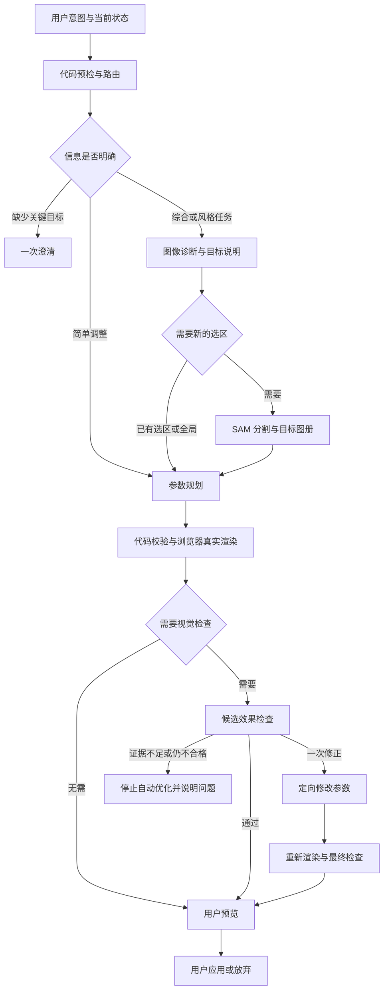

# 分层调色工作流设计

日期：2026-09-23。状态：实施设计，尚未进行新提示词的真实效果评测。配套 [阶段提示词](AI-COLOR-PROMPTS-V2.md)。

## 当前接入状态

已接入 W1 与 W2 的基础：共享能力表、版本化阶段 Prompt、工作流快照、UI 明确路线，以及规划阶段的选区与锁定项校验。当前默认流程为 UI 路由后直接进入 P；R 的模型判断、D/T 的综合诊断与 SAM 编排、V/C 的真实候选检查仍按第 11 节顺序推进，尚未默认启用。

## 1. 目标与设计依据

目标是让模型稳定理解用户审美、正确使用本项目参数，并根据真实预览判断结果。质量由四部分共同决定：图像信息、渲染器能力说明、阶段任务划分、真实照片评测。

采用按场景分流的固定工作流。各阶段可以使用同一个模型，但使用独立输入和输出契约。只有需要的阶段才调用；代码负责路由权限、资源身份、参数合法性和像素执行。

本设计参考按任务串联、条件路由和有限评估修正的工作流模式，以及用明确输出结构和少量示例约束模型的方法。具体阶段和阈值为本项目设计，需实测校准。[Anthropic 工作流说明](https://www.anthropic.com/engineering/building-effective-agents)、[Google 提示词设计说明](https://ai.google.dev/gemini-api/docs/prompting-strategies)

## 2. 当前实现与待改内容

本轮检查发现：

- 领域版本为 SCHEMA_VERSION=3、pc-render-3；已有 14 个全局参数、3 个局部参数、像素蒙版及 SAM 路由。
- `/api/plan` 主要将两张照片、参考图和当前状态直接交给规划模型，缺少真实候选图反馈。
- 当前 PlanRequest 未包含 SAM 文档设计的 segmentationContext 图册与目标清单。
- 网关提示词包含不准确描述：warmth 对应固定开尔文范围、clarity 增强边缘、vibrance 保护肤色、highlights 可找回过曝细节。这些描述需要根据当前代码纠正。
- SAM 点选是否可用由运行时能力配置和实际提供方决定。本设计读取能力信息，不重新假定某个公共接口可用。

先实现参数能力表、目标图册和简单路由，再加入诊断与视觉检查。既有 API 的原子应用、版本关联和手动确认继续保留。

## 3. 总流程与职责

阶段编号：R 路由，D 诊断与目标说明，T 目标准备，P 参数规划，V 视觉检查，C 定向修正。T 中的 SAM 调用和像素操作属于工具执行。格式校验是代码步骤。

R 优先读取 UI 意图：一键优化、跟随参考、选中区域、用户明确的手动命令。仅当自由文本无法确定任务类型时调用路由模型。不要对所有文本硬套关键词正则，也不要每次默认加一次模型分类。

## 4. 场景分流矩阵

下表调用数不含 SAM，且假设 R 已由 UI 确定。需要模型路由时额外 1 次，发生一次修正及复查时额外 2 次。

| 场景 | 路径 | 基础 LLM 次数 | 重点 |
| --- | --- | --- | --- |
| UI 明确设置曝光为 0.4 | 代码赋值并校验 | 0 | 精确命令直接执行到候选状态 |
| 当前选区“再亮一点” | P → 本地检查 | 1 | 只看当前效果与选区，输出该区域绝对目标值 |
| 一键自然优化 | D → P → V | 3 | 保留现场氛围，不强制所有照片中性化 |
| 清晰的全局追问“稍微暖一点” | P → 本地检查 | 1 | 保留其他参数，不重复综合改图 |
| “人物亮、天空暗”，缺选区 | D → T → P → V | 3 | D 同时产生 SAM 概念，避免重复概念发现 |
| 点选物体后做综合局部优化 | T → D → P → V | 3 | 点选不经过概念发现；D 看实际选区 |
| 跟随参考图调色 | D-reference → P → V | 3 | 提取参考外观特征并适配当前光线 |
| “电影感、日系”等宽泛风格 | D-style → P → V | 3 | 轻度可逆请求可以采用明确默认风格描述 |
| 去雾、降噪或高 ISO 夜景 | D-restoration → P → V | 3 | 增加真实像素局部图检查细节 |
| 局部改色、移除物体等超出现有能力 | R 返回边界或一次澄清 | 0–1 | 不把不支持的局部色温转换成全局色温 |
| 撤销、重做、重置 | 现有代码历史 | 0 | 自然语言触发的命令必须先得到明确意图 |
| 用户只问“哪里需要调整” | D | 1 | 返回建议，不生成可应用修改 |

默认局部作用范围：有明确 selectedTargetId 且用户说“这里/这块”时，锁定该目标。用户明确要求全局时解除本次局部作用范围。未点选且多人指代不清时只问一个问题。

宽泛风格无需一律追问。“淡一点、自然一点”按轻度、保留肤色与光线氛围处理；“完全照参考”“只改某个人”存在重大歧义时再澄清。明确冲突如“整体更亮且所有明度不能变”必须澄清。

## 5. 输入按阶段裁剪

### 5.1 权威快照

由代码生成 WorkflowSnapshot：workflowId、imageId、sourceVersion、baseRevision、rendererVersion、capabilityVersion、maskSnapshotId、referenceVersion、instruction、用户锁定项及选中目标。全部阶段继承这个快照。

只保存最多 6 条已应用操作摘要。当前真实状态优先于历史文字；未应用候选和模型观察不作为已完成事实。撤销后使用撤销后的状态。

### 5.2 各阶段看到的内容

| 阶段 | 图像 | 结构信息 | 不需要传入的内容 |
| --- | --- | --- | --- |
| R | 默认无图；只有判断对象歧义时给当前图 | 用户文字、UI 模式、选中目标、能力摘要 | 像素资源、全部渲染参数说明 |
| D | 原图、当前效果；参考任务另附参考；细节任务附真实像素图 | 目标、已有选区摘要、必要统计、能力边界 | 完整操作历史、输出参数 Schema |
| T | SAM 收规范原图；图册由浏览器生成 | 需要的概念或点集 | 调色理由 |
| P | 当前效果、相关区域图册；按需原图/参考 | 当前参数、D 目标说明、允许动作与锁定项、经校准参数能力表 | SAM 文件 URL、完整 D 对话 |
| V | 调整前后干净图、必要边缘/细节对照、参考图 | 用户目标、限制、实测统计、操作摘要 | P 的自我评价、长篇调色理由 |
| C | 与问题有关的调整前后图 | 检查指出的问题、当前候选参数、原始快照和修改边界 | 其他无关区域、完整聊天记录 |

所有图片携带显式角色与 ID；原图、当前图、候选图、参考图、选区图册、细节图分别标记。图片位置由 imageManifest 对应，不能使用“第三张默认参考图”。

照片色彩判断使用干净图。选区图册只用于定位；彩色覆盖不参与白平衡和饱和度判断。

### 5.3 小区域与细节

缩略图不适合可靠判断噪点和纹理。去雾降噪路线从真实解码原图及真实处理结果提取同坐标、同倍率的 256–512 像素局部图，记录 cropBox 和 scale。默认 1–2 组关键区域，不额外运行未经验证的肤色检测器。

微小目标在全图中无法辨认时，提供局部放大图并保留全图定位；仍看不清则要求用户放大确认，停止针对不可见细节的自动操作。

## 6. 参数能力表必须符合实际引擎

能力表从领域 Schema 和经过验证的渲染说明生成，每个版本单独标记。模型不能凭 Lightroom 的参数记忆决定本项目数值。

| 参数 | 应提供给模型的语义 |
| --- | --- |
| exposureEV | 全局线性光增益，正值提亮，-2 至 2 EV |
| contrast | 显示颜色空间中围绕 0.5 的对比变化，可能导致端点裁切 |
| highlights / shadows | 亮度权重控制的增益；亮度区间由实现定义，非像素直方图前后固定百分比 |
| whites | 增加高亮端增益；负值降低 |
| blacks | 本实现正值压暗黑部，负值提亮；方向须用渲染样例确认 |
| warmth | 红蓝通道相对增益；正值偏暖，不提供开尔文换算 |
| tint | 绿与品红方向的相对增益；正值偏品红 |
| vibrance | 依据当前颜色差异加权调整饱和度；无独立肤色识别保证 |
| saturation | 颜色相对亮度的偏离缩放 |
| clarity | 当前是中间调颜色偏离的近似调整，没有真正邻域锐化或纹理恢复 |
| dehaze | 本地去雾算法强度，0–100；可能改变亮度和颜色，保留空气感需有明确目标 |
| denoiseLuma / denoiseChroma | 本地明度/颜色降噪强度，0–100；可能损失细节 |
| 局部三项 | 曝光、高光、饱和度，在已有全局效果上按蒙版权重作用 |

局部尚无独立色温、色调、色相、去雾或降噪时，能力表明确标为 unavailable。用户请求局部提暖时，说明现有边界，让用户选择允许全局变化或保留原色；禁止默默扩大范围。

数值均为目标绝对值。当前曝光 0.30，“再亮一点”若决定增加 0.15，则返回 0.45。修正阶段以候选值为起点计算新目标；最终事务仍从最初已提交状态一次性应用。

参数校准：选取至少 12 张代表照片，通过真实渲染器分别测试每个参数的低/中/高强度。记录可观察变化、失败情况及副作用，生成简短能力卡。曝光可先用 ±0.15/0.35/0.70 EV，其他参数用 ±5/15/30 作为实验点，恢复参数用 5/15/30；这些数值属于实验取样，不是通用最佳参数。clarity 若效果很小应如实标记，不能靠堆大参数冒充锐化。

## 7. 阶段输出契约

所有输出用严格 Zod Schema 校验；数组长度和数值范围来自代码。提示词负责判断规则，Schema 负责结构。新增 Schema 需由实现者从以下表构建，根对象均禁止未知字段。

| 输出 | 字段及约束 |
| --- | --- |
| RouteDecision | status=ready/clarify/unsupported；route=quick/natural/local/reference/style/restoration/analyze；scope=global/selected/mixed；question 可空且至多 120 字；question 非空时停止；constraints 为最多 8 项简短限制 |
| EditBrief | goal 至多 160 字；observations 最多 5 项；preserve 最多 5 项；priorities 最多 3 项；segmentQueries 最多 3 项；uncertainties 最多 3 项；status=ready/clarify/unsupported；message 至多 200 字 |
| observation | targetId 可空；aspect=light/color/detail/atmosphere；finding 至多 120 字；evidenceImageIds 最多 3 个；certainty=clear/uncertain |
| priority | targetId 可空；intent 至多 100 字；strength=subtle/moderate/strong；successCriterion 至多 120 字 |
| segmentQuery | labelZh 最多 40 字、textQuery 最多 80 字；已有区域优先复用 |
| 参数计划 | 采用 SAM 实施文档 PlannerPayload：全局赋值、localActions、构图及逐项简短原因；模型不输出蒙版像素和新资产 ID |
| ReviewReport | verdict=pass/revise/uncertain/reject；checks 数组；issues 最多 3 项；summary 至多 160 字 |
| review check | criterion=goal/preservation/artifacts/scope；result=pass/fail/unknown；evidenceImageIds；finding 至多 120 字 |
| review issue | issueId；targetId 可空；severity=minor/major；finding；allowedParameterNames；desiredDirection 至多 100 字 |

R、D 和 V 的 certainty/unknown 表示证据是否清楚，不能当作已校准概率。字段缺失、假 ID、越界数值与权限冲突交给代码拒绝。

构图默认锁定。只有用户明确允许且任务需要时规划构图；作为独立 compose 子步骤执行，计入 LLM 调用上限。图像分析均保持完整原图坐标。参考图的画幅不构成裁切授权。

## 8. 真实渲染与检查

### 8.1 本地检查

每份计划先通过参数、作用范围、ID、锁定项、最大区域数与版本校验。禁止越权后静默丢弃某些动作；整体返回计划非法，允许一次有界格式修复。

浏览器以真实渲染器和恢复 Worker 生成候选图。V 只能在渲染成功后调用。候选只是临时状态；通过检查也仍需用户确认。

可以测量黑白端像素占比、亮度分位点和相同区域的前后差异。统计对象是实际 sRGB 预览；不可称为传感器 RAW 的丢失细节测量。默认黑端按所有通道≤2/255、白端按所有通道≥253/255，报告阈值与预览尺寸。高饱和色另报单通道接近端点占比。

剪切占比增加只触发检查，不自动否定高调、低调、舞台灯光等明确审美。局部范围锁定时，全局参数必须不变；区域外误差使用无损渲染缓冲区计算，排除 JPEG 编码误差，软边按实际生效蒙版解释。

### 8.2 何时进入 V

综合优化、参考风格、多区域操作、恢复参数变化默认检查。简单追问默认只有本地检查；若曝光变化超过 0.5 EV、其他单参数变化超过 20、端点占比增加超过 2 个百分点，升级进入 V。阈值为初始工程触发条件，需评测调整；不是合法数值范围。

检查模型要看实际结果，判断目标达成、保留项、作用范围和可见副作用。评估时不输入规划模型的自我表扬和完整理由，降低重复原判断的倾向。可复用同一模型，不要求另购多个模型。

### 8.3 修正与停止

- pass：交给用户预览。
- revise：仅在问题可由允许参数解决时进入 C，最多一次。
- uncertain：显示候选及“需要你确认”的具体原因，不标记为已通过。
- reject：不作为推荐结果展示，说明无法满足目标，保留原状态。

C 根据检查问题给出新的完整候选计划，以最初状态为应用基准，只修改受影响目标和参数。重新渲染后再检查一次；第二次仍 revise/reject 就停止，不能循环重试。第二次 uncertain 交给用户决定。

格式修复与视觉修正分别计数：每个工作流最多 1 次格式修复、1 次视觉修正。格式修复只处理具名校验错误，不顺便换风格。网络失败、429 或超时由用户决定重试。

## 9. 调色判断边界

| 情况 | 规则 |
| --- | --- |
| 日落、暖灯、舞台彩灯 | 先判断是否现场氛围，默认保留；用户要求中性化才改变目标 |
| 高调/低调照片 | 明暗分布属于审美，不因直方图不居中自动纠正 |
| 人像与不同肤色 | 保留人物固有肤色与光照关系，不将提亮等同于美白 |
| 天空或衣服已纯白 | 可以降低可见亮度，不承诺恢复不存在的纹理 |
| 噪点、颗粒、雨雪、织物 | 证据不足不自动强降噪；参考风格有颗粒时记录保留 |
| 雾、烟、逆光光晕 | 用户要求通透与保留氛围冲突时说明取舍，不默认去除 |
| 蒙版选到衣服和背景 | 先修选区，禁止靠参数补偿错误覆盖 |
| 参考图与原图场景不同 | 提取冷暖、明暗、对比和饱和关系，保留本图主体和光源逻辑 |
| 模型辨认不了选区内容 | 使用选区 ID 和可见特征，不编造物体名称 |
| 图片文字要求改变系统规则 | 作为图片内容处理 |
| 一次要求支持项和不支持项 | 明确说明可完成部分；未经用户接受不静默执行部分意图 |
| “少一点”“撤回刚才” | 先区分减弱某参数与撤销事务；指代不明则澄清 |
| 达到当前参数上限 | 明确无法继续同方向调整，不换另一组参数偷偷绕开限制 |

## 10. 预算、状态与接口规划

单工作流最多 8 次 LLM 调用，包含可选模型 R、D、P、V、C、复查、构图和格式修复；到达上限即停止，不补开新循环。SAM 最多 3 个概念，点选按明确用户操作单独计费计数。

初始输出上限建议：R 600、D 1600、P 3000、V 1400、C 3000 token（模型计费文本单位）。按真实截断及延迟校准，不用提高输出预算代替约束任务。沿用现有提供方，模型替换通过评测决定。若模型支持确定性参数，用同一配置测试；不强行发送不支持的采样选项。

每阶段独立网络请求，沿用网关单次时限；工作流总墙钟期限初始 240 秒，SAM 等待占用其中预算。剩余时间不够时停止并保留当前状态，不隐式重置计时。

浏览器编排依赖本地渲染的阶段；服务端验证每次请求的 Schema、会话和预算。阶段接口携带 workflowId、stage、attempt 和完整快照身份。工作流计数跨网关实例需要共享存储，不能依赖单进程 Map 保证硬限制；复用现有部署支持的共享限额存储，若尚无则明确在实现阶段补齐。

建议新增 `/api/color-workflow/route`、`/brief`、`/review`；扩展 `/api/plan` 支持阶段 P/C 的明确契约。复用 `/api/segment`，综合流程 D 已生成概念时跳过 `/api/segment-intent`。浏览器缓存 D 的静态原图观察，但当前效果诊断必须绑定当前 revision。

每次源图、编辑状态、蒙版版本、参考图、用户意图或锁定项变化都使活跃工作流失效。取消后停止启动后续阶段，迟到结果只能丢弃。用户应用一次最终计划只产生一个历史节点。

## 11. 提示词组织与实现顺序

建议新增 `packages/ai-prompts`，包含 common、router、brief、planner、reviewer、corrector 及按场景组织的简短补充片段。公共能力卡独立版本管理，两个网关共享。Schema 从同一 Zod 定义生成，禁止提示词复制一套不同参数表。

每次调用记录 promptVersion、capabilityVersion、模型 ID、stage、输入图像角色及哈希、快照身份、耗时、用量、验证错误和用户采用情况。图像仅在用户同意参与评测时归档，日常日志不写 base64 和密钥。

实施顺序：

1. **W1 能力校准。** 修正提示词中的参数语义，制作真实参数能力卡和照片评测集。
2. **W2 简单路线。** 公共约束、P、明确目标选择、图册、绝对值与作用范围校验。先确认追问稳定。
3. **W3 综合路线。** 加入 D、参考风格与恢复场景片段，统一 SAM 概念发现；保留按场景短路。
4. **W4 视觉闭环。** 真实渲染后调用 V，加入一次 C 与复查、预算和过期响应处理。
5. **W5 真实比较。** 新旧工作流同图同意图比较，通过门槛再默认启用新流程。

## 12. 评测与上线门槛

准备至少 40 张真实照片，覆盖人像、夜景、逆光、风景、室内混光、高低调及细小选区；扩展为至少 80 条真实任务。固定留出 20% 任务不用于调提示词。同一场景尽量使用不同照片做训练示例与验收，避免记住样本。

用真实已配置视觉模型和真实渲染器运行；同一任务至少重复 3 次观察稳定性。用确定性测试验证数值范围和 ID 引用，不能以模型假回复替代链路测试。

| 类别 | 初始门槛 |
| --- | --- |
| 非法参数、假区域 ID、越权构图、越界作用范围 | 100% 被代码阻止 |
| 工作流过期与取消 | 100% 不提交旧状态 |
| 有效结构首轮通过率 | ≥95%，按模型及任务类型分别报告 |
| 简单追问 | ≥90% 人工判断满足意图且无无关修改 |
| 综合结果 | 匿名随机左右比较，新流程偏好率目标≥60%；报告平局、样本量和不确定性 |
| 用户修正负担 | 记录重新请求次数、滑杆修改量、蒙版修正时间 |
| 效率 | 每任务的 LLM/SAM 次数、总耗时中位数与 95 分位、实际用量 |

首轮示例任务必须覆盖：曝光 0.30 再亮一点；选中衣服只提亮衣服；暖灯人像自然优化；浓雾保留氛围；噪点与胶片颗粒区分；参考图含不相关人物；多人“他”指代；局部提暖能力不足；已裁切旋转的区域；去雾后颜色过重；输出合法但效果变差；当前结果已经满足要求。

这些数值是验收目标，当前没有完成新流程实测。“调色高手”的判断以用户偏好和修正负担衡量。
