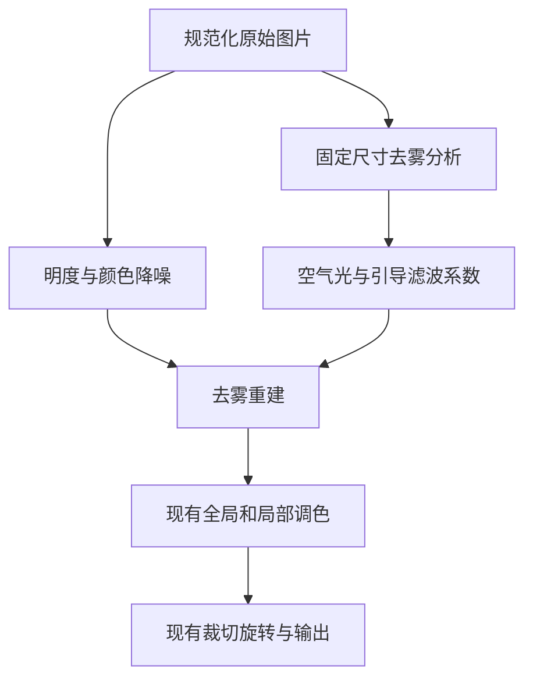

# 浏览器去雾与降噪实现计划

更新日期为 2026-09-22。本文以当前仓库代码为依据，交付目标是可直接开发的功能规格与任务顺序。

## 1. 最终效果

在现有编辑器中增加三个滑杆，全部在浏览器内处理。

| 界面名称 | 功能 | 范围 | 默认值 |
| --- | --- | --- | --- |
| 去雾 | 减轻雾气造成的发白与低对比 | 0 至 100 | 0 |
| 明度降噪 | 减少照片中的亮暗颗粒 | 0 至 100 | 0 |
| 颜色降噪 | 减少暗部红绿蓝杂点 | 0 至 100 | 0 |

三个参数均支持预览、归零、撤销、重做、AI 建议和现有格式导出。所有步长均为 1。照片与处理结果保留在当前浏览器会话中。

功能采用 OpenCV.js 图像处理库。它把成熟的图像算法带到浏览器，省去自行编写滤波器的工作。较重的运算放在 Web Worker 后台线程，页面继续响应点击与拖动。现有 WebGL2 调色器继续负责曝光、色彩、局部调整、裁切与旋转。

本轮实现全图去雾与降噪。局部区域继续使用现有调整能力，物体分割另行设计。RAW 文件沿用现有解码流程，本轮处理的是解码后的 RGB 图像。

## 2. 当前代码与必须接通的位置

下列路径以仓库根目录为起点。开始实施时重新确认符号仍存在，按职责定位，不依赖固定行号。

| 文件 | 当前职责 | 本轮改动 |
| --- | --- | --- |
| `packages/domain/src/index.ts` | 参数 Schema 数据结构校验、默认值、AI 赋值与摘要 | 增加三个全局参数，同步范围和版本 |
| `packages/renderer/src/index.ts` | 单个片元着色器完成调色，加载图片纹理与导出像素 | 接收处理后的图片，分开逻辑原图尺寸与实际纹理尺寸 |
| `apps/web/src/state/editor.ts` | 多图会话、历史与临时拖动状态 | 保持参数历史，失效旧计算任务，重置新参数 |
| `apps/web/src/app/ControlsPanel.tsx` | 参数面板 | 去雾滑杆及明度、颜色降噪滑杆 |
| `apps/web/src/app/App.tsx` | 画布渲染、AI 缩略图、原图对比、所有格式导出 | 统一调用处理入口，防止遗漏某一输出路径 |
| `apps/web/src/lib/image-import.ts` | 浏览器、TIFF 和 RAW 解码 | 沿用现有输出，本轮无需增加解码器 |
| `packages/ai-contract/src/index.ts` | AI 请求及计划 Schema | 同步新参数与版本，继续从领域 Schema 生成模型格式 |
| `apps/gateway/src/index.ts` | Node 网关的模型提示和响应 | 更新参数解释、范围和版本常量 |
| `apps/cloudflare/src/index.ts` | Cloudflare 网关的模型提示 | 更新相同能力说明 |
| `packages/domain/test/domain.test.ts` | 领域测试 | 覆盖新参数赋值、范围和历史相关不变量 |

当前实现已有 11 个全局参数、椭圆蒙版、渐变蒙版和画笔蒙版。当前导入上限为一亿像素、边长 16384、文件 100 MiB。现有导出包含 JPEG、PNG、WebP、AVIF 和 TIFF。开发应保持这些功能入口。

当前画布预览、AI 当前效果图、导出分别创建 `PhotoRenderer` 实例。三个入口必须接入同一处理流程。

当前 `analysisBlob` 方法会从已经显示的画布重新取图再调色。新流程应直接读取规范化原始 Blob，消除重复调色的路径。当前对比通过清空全局参数实现，增加预处理后还需要切换回原始图片纹理。

## 3. 已确定的技术路线

| 项目 | 决定 | 对使用与维护的影响 |
| --- | --- | --- |
| 去雾 | 暗通道先验与灰度引导滤波 | 有明确公式，能解释结果，需检查天空和白色物体 |
| 降噪 | 分离明度与颜色的双边滤波 | 接入成熟库，强度过高时会损失细纹理 |
| 运算位置 | 浏览器 Worker 中的 OpenCV.js WebAssembly | 不消耗服务器图像计算资源，首次使用需要加载库 |
| 调色显示 | 保留现有 WebGL2 | 降低对已有色彩和几何行为的影响 |
| 工作精度 | 中间矩阵使用 32 位浮点，输出一次转为 8 位 sRGB | 避免多次滤波过程中反复取整 |
| 交互 | 缩略预览加原尺寸局部检查 | 较快看整体效果，也能判断真实颗粒与细节 |
| 导出 | 按原图分辨率处理，按块控制临时内存 | 保留细节，耗时随图片尺寸增加 |

OpenCV.js 提供 `bilateralFilter` 双边滤波、`erode` 腐蚀与 `boxFilter` 方框均值滤波。灰度引导滤波用这些基础算子与论文公式组合，避免依赖未经确认的扩展模块。

依赖选择 `@techstark/opencv-js`，它打包了 OpenCV.js 并提供 TypeScript 类型。实施第一步核实 npm 已发布版本及实际导出的函数，锁定通过浏览器实验的准确版本。仓库主分支版本与 npm 发布状态分开检查。本文引用的 OpenCV API 文档为 4.13.0，包的当前主分支已标记 5.0.0；函数签名与行为需用所选版本确认。

首次使用新功能时动态加载 Worker 和算法库。资源随应用同源部署。两个滑杆组保持默认零值时，不加载 OpenCV，也不创建处理线程。

## 4. 处理顺序与数据来源



图中顺序表示像素效果关系。现有着色器可以继续通过逆向采样实现裁切旋转，无需为几何变换另存整张图片。

统一输入来自 `ImageSlot.blob`，即导入流程产生的规范化图片。每次处理都以它为源头，避免重复降噪或重复去雾。

先降噪再去雾，可以减轻去雾放大已有颗粒的现象。去雾分析固定读取原始图片，改变曝光、裁切或降噪强度均不改变空气光与雾分布估计。

### 4.1 三种坐标

| 坐标 | 用途 | 必须保持的规则 |
| --- | --- | --- |
| 原图坐标 | 裁切、局部区域、导出和原尺寸检查 | 继续使用原图宽高 |
| 预处理纹理坐标 | 从缩略预览或完整处理图取色 | 使用实际纹理宽高计算像素中心 |
| 去雾分析坐标 | 雾分布估计 | 完整原图缩到长边最多 1024，所有输出共用 |

当前 `u_size` 同时参与图片几何和 texel 像素采样。接入缩略预览时拆为原图尺寸与纹理尺寸两个变量。几何公式、画笔坐标和蒙版位置继续以原图尺寸为准，四点取色使用实际纹理尺寸。

### 4.2 颜色空间

降噪在编码后的 sRGB 浮点值上执行，范围为 0 至 1。YCrCb 是把图像分为亮度与两种颜色差的表达方式，本方案用它独立控制颗粒和彩色噪点。

去雾分析和重建使用线性 RGB。线性 RGB 更接近光强，空气光相加和相减在这里计算。sRGB 解码和编码复用项目现有公式，不把 0 至 255 的整数直接代入线性光计算。

降噪输出先转线性 RGB，再去雾，最后编码回 sRGB。处理结果作为图片纹理交给现有渲染器，现有渲染器继续执行其正常的 sRGB 解码。

新功能全部为零时直接使用原始图片资源，逐像素恒等，跳过颜色转换。

## 5. 参数与状态契约

将三个参数加入现有 `global` 全局参数对象，避免建立第二套无法参与撤销的界面状态。

| 字段 | 中文名称 | Schema 规则 |
| --- | --- | --- |
| `dehaze` | 去雾 | 有限整数，0 至 100，默认 0 |
| `denoiseLuma` | 明度降噪 | 有限整数，0 至 100，默认 0 |
| `denoiseChroma` | 颜色降噪 | 有限整数，0 至 100，默认 0 |

同步修改 `globalKeys`、`globalParameterLabels`、`GlobalSchema`、`defaultGlobal` 与全局赋值数量上限。全局数组上限使用 `globalKeys.length`，新总数为 14。保持现有逐参数范围校验。

`schemaVersion` 更新为 2，`rendererVersion` 更新为 `pc-render-2`。所有请求与响应使用共享常量，检查并替换本次涉及的硬编码版本。当前会话为内存状态，刷新后创建新结构，无需增加旧状态迁移逻辑。

AI 可以赋予这三个参数目标绝对值。网关提示说明新参数范围为 0 至 100，其他旧参数沿用既有范围。解释中明确去雾减轻可见雾气，降噪减弱颗粒并可能平滑纹理。初次自动建议保持保守，用户明确提出再加强时允许提高。

AI 候选方案、已提交状态与临时拖动状态都用同一计算入口。参数仍由现有编辑事务管理，一次拖动产生一个历史节点。

## 6. 降噪算法

### 6.1 输入与固定参数

输入为规范化原图或其预览版本的 RGB，通道顺序固定为 R、G、B。使用 `cv.cvtColor` 做 RGBA 转 RGB，禁止默认假设浏览器输入为 BGR。

转为 `CV_32FC3` 三通道浮点矩阵并除以 255。所有双边滤波的输入与输出使用独立矩阵，OpenCV 双边滤波不做原地写入。

| 参数 | 固定值 | 含义 |
| --- | --- | --- |
| 邻域直径 `d` | 5 | 每个像素最多参考周围 5 × 5 范围 |
| 空间尺度 `sigmaSpace` | 1.5 像素 | 附近像素的权重衰减速度 |
| 明度 `sigmaColor` | 12 / 255 | 接近的亮度更容易被平滑 |
| RGB 颜色候选 `sigmaColor` | 35 / 255 | 生成减少彩色杂点的候选图 |
| 边界 | `BORDER_REFLECT_101` | 在整张图片边缘采用镜像扩展 |

以上是首版待实拍校准的算法常数，集中放在一个文件。它们不是供应商定义的摄影软件参数。若调整，需要重新记录质量验证结果。

### 6.2 明度与颜色独立处理

1. 将原始 RGB 转为浮点 YCrCb，得到 `Y0`、`Cr0`、`Cb0`。OpenCV 顺序为 Y、Cr、Cb。
2. 明度参数大于零时，对 `Y0` 做单通道双边滤波，得到 `Yf`。
3. 颜色参数大于零时，对原始 RGB 做三通道双边滤波，得到颜色候选 RGB。
4. 将颜色候选 RGB 转为 YCrCb，取其 `Crf` 与 `Cbf`。原始明度由明度分支决定。
5. 按滑杆强度混合三个通道，再转回 RGB。

数学定义如下，`L` 为明度参数除以 100，`C` 为颜色参数除以 100。

```text
Y  = Y0  + L × (Yf  - Y0)
Cr = Cr0 + C × (Crf - Cr0)
Cb = Cb0 + C × (Cbf - Cb0)
```

这些式子让滑杆控制原通道与滤波结果之间的比例。明度降噪为零时保留原亮度，颜色降噪为零时保留原颜色差。两项为零时整个降噪步骤直接返回原像素。

本方案采用 RGB 候选保护明显的颜色边界，颜色颗粒的抑制仍需通过真实夜景校准。不要把双边滤波结果标成模型降噪或专业 RAW 降噪。

### 6.3 强度与缩放

滤波直径和空间尺度以当前处理图的像素为单位。完整导出和原尺寸局部检查都使用源图像素，因此具有一致的颗粒语义。

缩到长边 2048 的整体预览使用相同滤波常数，属于快速近似。缩图本身会减轻颗粒，界面提供原尺寸局部检查作为判断降噪效果的入口。不能用缩略预览替代原尺寸导出。

## 7. 去雾算法

### 7.1 分析图

从规范化原图制作长边最多 1024 的完整分析图。使用 OpenCV `resize` 和 `INTER_AREA` 面积缩小，保持比例。先在编码 sRGB 中缩小，再转换为线性 RGB。保留实际分析宽高及变换比例。

分析输入不包含后续降噪、色彩、裁切或局部调整。同一图片会话只计算一次分析，结果绑定原图身份和算法版本。

### 7.2 暗通道与空气光

暗通道取一个邻域内所有 RGB 通道中的最小值。直观地说，普通场景常能找到较暗像素，雾气会把这些像素抬亮。

```text
D(x) = 邻域 Ω(x) 内 min(R, G, B) 的最小值
```

先逐像素取三个通道最小值，再调用 `cv.erode`，矩形核为 15 × 15，边界使用 `BORDER_REFLECT_101`。分析图很小时，核缩到不超过短边的最大正奇数。

空气光 `A` 是 RGB 三元组，表示雾带来的背景光。

1. 按暗通道值降序排序，取前 `max(1, ceil(像素数 × 0.001))` 个位置。
2. 在候选位置中选择原分析图线性亮度最高的一个位置。
3. 用该位置的线性 RGB 作为 `A`。亮度权重使用 0.2126、0.7152、0.0722。
4. 同分时按行优先像素索引升序选择，保证重复运行稳定。

分母使用 `max(Ac, 0.001)`，其中 `Ac` 为相应通道。此下限是算法的数值稳定常数，保存在配置文件中。空气光必须使用同一个像素的 RGB，不能分别从三个不同位置取各通道最大值。

### 7.3 粗透射率

透射率 `t` 表示场景光透过雾后剩余的比例。越小表示估计的雾越重。

```text
N(x)  = min(R(x) / Ar, G(x) / Ag, B(x) / Ab)
Dr(x) = 对 N 使用相同 15 × 15 最小值滤波
p(x)  = clamp(1 - 0.95 × Dr(x), 0, 1)
```

`0.95` 保留少量雾感，减少完全去除散射带来的生硬结果。`clamp` 表示将数值限制在指定区间。

### 7.4 引导滤波

引导滤波使用原图亮度帮助透射率贴合物体边缘，减少树枝和建筑周围的粗糙边界。

引导图 `G` 使用分析图的线性亮度。窗口半径 `r = 16`，即 33 × 33。窗口过大时按短边缩小为可用正奇数。正则项 `epsilon = 0.001`，输入范围为 0 至 1。

以下 `mean` 是通过 `cv.boxFilter` 实现的归一化窗口平均，边界统一使用 `BORDER_REFLECT_101`。

```text
meanG = mean(G)
meanP = mean(p)
varG  = max(mean(G × G) - meanG × meanG, 0)
covGP = mean(G × p) - meanG × meanP
a     = covGP / (varG + epsilon)
b     = meanP - a × meanG
meanA = mean(a)
meanB = mean(b)
```

这组公式用局部亮度变化修正雾分布。保存 `meanA`、`meanB` 两张浮点系数图，后续在不同尺寸上复用。不要先把系数转成 8 位图片。

### 7.5 在输出分辨率重建

对每个输出像素，根据其在完整原图中的位置，用双线性插值读取 `meanA` 和 `meanB`。引导亮度 `Gfull` 来自相同位置的原始图片，保持分析依据稳定。

```text
t        = clamp(meanA_up × Gfull + meanB_up, 0, 1)
tSafe    = max(t, 0.15)
Jc       = (Ic - Ac) / tSafe + Ac
strength = dehaze / 100
Oc       = Ic + strength × (Jc - Ic)
```

`Ic` 是降噪后的线性通道，`Jc` 是去雾候选值，`Oc` 是最终线性值。`tSafe` 限制极小透射率，避免噪点被无限放大。滑杆控制原效果与去雾候选的混合比例。

混合完成后再将 RGB 限制到 0 至 1，编码为 sRGB。去雾为零时跳过分析及重建。已有分析缓存可以保留到切换图片或释放会话。

空气光和系数图全图共用，分块导出期间禁止逐块重新估计空气光。

### 7.6 系数取样坐标

以目标完整处理图宽高 `Wout`、`Hout` 和像素坐标 `x`、`y` 计算。

```text
u = (x + 0.5) / Wout
v = (y + 0.5) / Hout
analysisX = u × analysisWidth - 0.5
analysisY = v × analysisHeight - 0.5
```

分块时 `x`、`y` 必须包含分块在完整处理图中的偏移。系数边缘夹取有效像素。原尺寸局部检查使用其在完整原图中的位置，不能把局部检查框当作整张照片。

## 8. 模块与函数契约

采用以下内聚模块。允许按现有目录惯例微调命名，职责和输入输出保持一致。

| 文件 | 职责 |
| --- | --- |
| `apps/web/src/lib/restoration/client.ts` | 主线程任务管理与最新结果接收 |
| `apps/web/src/lib/restoration/worker.ts` | Worker 消息入口、资源所有权与调度 |
| `apps/web/src/lib/restoration/opencv.ts` | 按固定版本加载 OpenCV 并检查真实能力 |
| `apps/web/src/lib/restoration/dehaze.ts` | 暗通道、空气光、引导系数与重建 |
| `apps/web/src/lib/restoration/denoise.ts` | 双边滤波与 YCrCb 混合 |
| `apps/web/src/lib/restoration/types.ts` | 任务、输出和参数类型 |
| `apps/web/src/lib/restoration/constants.ts` | 算法常数与版本 |

文件和核心函数使用中文注释，解释坐标、颜色空间、生命周期与算法原因。

| 函数 | 输入 | 输出 |
| --- | --- | --- |
| `initializeOpenCv` | 固定版本资源地址 | 已初始化运行时，缺少必需函数立即报错 |
| `analyzeDehaze` | 完整原始分析图、图片身份 | 空气光、系数图、宽高、算法版本 |
| `denoiseTile` | 带边缘邻域的浮点 RGB、两个强度 | 同尺寸浮点 RGB |
| `restoreTile` | 原始块、全图位置、三个强度、分析结果 | 处理后的中心区域 RGBA |
| `prepareRestoredImage` | 原始 Blob、imageId、参数、目标模式、取消标识 | 完整处理图或原尺寸局部图及尺寸 |
| `releaseImage` | imageId | 删除对应图片、系数和处理缓存 |
| `dispose` | 无 | 释放本轮线程、计时器和资源 |

目标模式枚举为 `preview` 预览、`detail` 原尺寸检查、`export` 导出。AI 效果图从原尺寸处理结果缩小生成，按第 11 节执行。

首次运行检查 `Mat`、`cvtColor`、`bilateralFilter`、`erode`、`boxFilter`、`resize`、`split`、`merge` 和所用矩阵运算。选定包没有某项操作时，在依赖接入任务中解决其构建或版本问题。类型声明存在不代表运行时函数可用。

## 9. 后台任务、取消与缓存

任务携带 `imageId`、`generation`、三个参数、处理模式、目标尺寸与算法版本。`generation` 是递增的计算序号，用来区分先后启动的处理。

主线程只安装与当前图片、当前参数、当前任务序号一致的结果。这里的“安装”指将结果图片交给渲染器成为当前纹理。

| 操作 | 计算行为 |
| --- | --- |
| 去雾或降噪滑杆变化 | 120 毫秒防抖，最多一个运行任务和一个最新待处理任务 |
| 松开滑杆 | 立即提交历史事务，安排最终参数任务 |
| 改曝光、色温或局部参数 | 复用预处理图片，调用现有着色器 |
| 改裁切、旋转或窗口大小 | 保持预处理图片，改变现有采样几何 |
| 切换照片、删除照片、重置 | 旧任务标记失效，释放不再使用的结果 |
| 撤销与重做 | 读取恢复后的参数，命中缓存或重算 |

缓存键包括图片 ID、算法版本、三个强度、输出尺寸和模式。去雾分析缓存只依赖图片 ID、分析尺寸和算法版本。不得把调色 revision 直接作为昂贵预处理缓存键，否则每次曝光变化都会重新降噪。

默认只保留当前图片的分析结果和一个最新整体预览。原尺寸检查结果使用一个独立槽位。导出结果在编码结束后释放。零参数时直接切回原图。

OpenCV 的单次同步调用不能被 AbortSignal 中途打断。Worker 每处理完一块后主动让出事件循环，再检查取消与最新任务。需要立即停止时终止 Worker，下次明确操作时重新初始化。

等待期间可以保留上一次画面并显示“正在更新”。失败时结束任务、记录错误并明确标记当前效果未完成。失败状态禁止导出当前新参数的伪结果。

算法函数遇到无效参数、矩阵错误和非有限结果时在源头抛出具名错误。Worker 消息边界负责一次结构化错误传递，不重试、不更换算法、不返回原图冒充成功。资源清理使用 `finally`，保留原错误。

日志记录任务 ID、图片 ID、阶段、尺寸、参数、用时及错误栈。日志不记录图像正文。

## 10. 预览与分块

### 10.1 整体预览

整体预处理预览长边最多 2048，短边按比例取整。小图保持原尺寸。调整窗口和设备像素比不会改变预处理缓存尺寸。

预处理结果使用 ImageBitmap 在 Worker 与主线程之间转移，避免先编码 JPEG 再解码。图像控制点和蒙版始终绑定逻辑原图尺寸。

### 10.2 原尺寸局部检查

新增“查看细节”入口。在完整原图上选择一个最多 512 × 512 的检查区域，以一个源图像素对应一个显示像素展示。可移动检查中心，并提供该区域原图与处理后对比。

检查区域包含 2 像素滤波邻域。去雾读取全图分析结果。后续调色与局部蒙版使用原图位置，不能以局部区域坐标重新解释蒙版。

展示前确认界面尺寸和设备像素比，避免把 512 像素图再次缩放后称为原尺寸。小屏容器可滚动查看。

### 10.3 原尺寸处理块

完整导出按 512 × 512 中心块处理，四周读取最多 2 像素邻域。双边滤波直径为 5，所以所需邻域半径为 2。

每块读取原始图像，执行降噪、去雾，然后只写回中心区域。两个降噪候选均直接来自原始块，它们之间没有串联滤波，因此半径无需累加。

内部块从真实相邻像素读取邻域；只在完整图片边缘采用镜像边界。通过完整图与分块图对照确认边界没有亮线和色差。

临时 OpenCV 矩阵保持在块尺寸内。分析矩阵保持在 1024 长边内。完整输出使用一张 OffscreenCanvas 后台画布依次接收中心块，完成后转移 ImageBitmap。

分块减少临时矩阵内存。原始解码图片、完整输出画布与最终 GPU 纹理仍然占用整图内存。一亿像素 RGBA 的单份未压缩数据约为 400 MB。实施必须记录大图峰值资源与限制，分配失败立即结束并报告尺寸；禁止静默缩小导出。

### 10.4 OpenCV 资源释放

所有 `cv.Mat`、`MatVector`、结构元素以及从向量取出的矩阵句柄都需要显式释放。ROI 子区域句柄也需要删除。使用 `try/finally` 表达所有权。

转移给主线程的 ImageBitmap 由主线程负责关闭，Worker 不再持有。丢弃过期结果时立即关闭。缓存替换与删除照片时释放旧结果。关闭页面或组件卸载时终止 Worker。

## 11. 预览、对比、AI 与导出接线

| 路径 | 必须使用的输入 | 完成条件 |
| --- | --- | --- |
| 普通画布 | 最新预处理预览加当前调色状态 | 新参数匹配的图片准备完成 |
| AI 候选画布 | 候选参数的预处理结果加候选调色状态 | 准备完成后才显示完整候选效果 |
| 原图对比 | 原始图片加清零后的全局参数、空局部区域 | 保持既有对比几何语义 |
| AI 原图 | 规范化原始 Blob | 无去雾、降噪和调色 |
| AI 当前效果 | 原尺寸预处理结果经完整原图调色后缩到 1024 | 全图角度为零、裁切为完整原图，实际构图另随状态发送 |
| JPEG、PNG、WebP、AVIF | 原尺寸预处理结果加冻结后的状态 | 沿用对应编码器 |
| TIFF | 与其他格式相同的处理结果 | 使用现有 UTIF 编码器 |

AI 当前效果图使用原尺寸处理结果，是为了让模型看到与最终导出一致的降噪效果。可能增加第一次 AI 请求前的等待时间，界面显示“正在准备图片”。同参数导出或请求可以复用尚未释放的结果，禁止无限保留多个大图缓存。

导出冻结当前已提交状态及图像身份。等待与该参数组合完全匹配的原尺寸处理结果，再进行调色、裁切和编码。预览尚在计算时不能直接读取画布导出。

原尺寸检查和导出可顺序复用同一个 Worker，导出时禁用参数编辑并提供取消。任务完成、失败或取消后都释放导出临时资源。

`PhotoRenderer` 中的 sourceWidth 与 sourceHeight 继续来自逻辑原图。为局部检查增加采样区域入口，让片元先转换到全图归一化坐标再应用现有蒙版。所有导出格式共用该取色和调色逻辑。

## 12. 界面与交互

去雾放在现有光线或效果分组，明度降噪和颜色降噪放在“细节”分组。复用现有 Slider 滑杆组件和历史事务。

必要状态文案如下。

| 场景 | 文案 |
| --- | --- |
| 首次加载库 | 正在准备图像处理 |
| 参数变化等待 | 正在更新 |
| 原尺寸检查 | 正在处理细节 |
| 导出原图 | 正在处理原尺寸图片 |
| 确认失败 | 图像处理失败，请查看错误详情 |

错误详情提供具体失败阶段与错误编号。页面无需展示算法名称、Worker 或模型实现说明。

三个滑杆支持数值输入、键盘调整与归零。归零恢复该参数默认值；全部参数归零后恢复原图资源。明度与颜色降噪分别提供简短提示，说明颗粒与彩色杂点的差别。

## 13. 开发任务顺序

### D01 真实库接入

建立 Worker、固定依赖版本、同源资源加载与初始化错误传播。使用真实浏览器调用 5 × 5 双边滤波、浮点腐蚀与方框滤波。验证发布构建中 Worker 地址与算法资源可加载，页面默认零参数时没有下载算法库。

退出标准是小型真实图片能得到处理结果，所有矩阵可释放，初始化失败能准确报出。先解决运行时问题，再继续实现界面。

### D02 参数与公共预处理入口

增加三个全局字段、中文名称、默认值、版本与赋值上限。建立 `prepareRestoredImage` 公共入口，零参数直接返回原图资源。接入现有 renderer 的纹理尺寸与原图尺寸分离。

退出标准是零参数下原图、裁切、旋转、局部区域与现有导出不发生变化。

### D03 降噪

实现第 6 节完整公式、真实分块处理、原尺寸局部检查和缓存键。完成两项降噪参数的交互与历史。

退出标准是颜色杂点明显减弱、亮度通道独立可控、原尺寸细节可以检查，块间无接缝。

### D04 去雾

实现第 7 节分析、系数缓存、全图坐标重建及去雾滑杆。处理与降噪组合时保持固定顺序。

退出标准是有雾照片的远处轮廓更清楚，正常白色物体和天空的副作用可接受，纯黑纯白图无非法数值。

### D05 全部输出接线

统一普通预览、AI 候选、原图对比、AI 当前效果图和全部导出格式。更新两个网关的提示词及共享版本。验证原尺寸处理完成后再编码输出。

退出标准是图像输出路径均调用相同算法，AI 赋值能通过 Schema 并实际生效。

### D06 验证与交接

完成下一节的测试和真实图片对照，记录依赖版本、浏览器、设备、时延、内存表现与问题。完成代码后交由使用者人工检查真实照片，获得确认后再创建功能提交。

## 14. 验证清单

### 14.1 算法与不变量

使用真实 OpenCV 运行时验证，不替换为假实现。人工构造色阶、边缘和噪声图可以验证数学性质，但照片效果用真实图片判断。

| 用例 | 预期结果 |
| --- | --- |
| 三项全零 | 源像素逐字节保持，算法库未被调用 |
| 纯黑、纯白、中性灰 | 不出现 NaN、Infinity 或明显偏色 |
| 灰度图颜色降噪 | 输出保持灰度，亮度变化只允许最终舍入误差 |
| 颜色降噪为零 | YCrCb 颜色差保持，允许转回 RGB 的量化和色域裁切误差 |
| 明度降噪为零 | 亮度保持，允许转回 RGB 的量化和色域裁切误差 |
| 固定图像与参数重复运行 | 同一版本与运行环境结果一致 |
| 完整处理与分块处理 | 平均每通道差不超过 1 个 8 位等级，最大差不超过 2 |
| 全图与原尺寸局部检查 | 对应源图位置结果满足相同像素误差门槛 |
| 去雾强度为零 | 跳过分析，组合结果等于单独降噪 |
| 参数越界或非有限数 | 源头报错，无伪成功结果 |

引导滤波系数使用一个极小输入矩阵与论文公式手算结果对照，验证窗口平均、边界和矩阵类型。只校验实现真实的不变量，避免复制一份同样可能出错的实现作为答案。

### 14.2 真实照片

准备至少 12 张有使用权限的照片，包含远山薄雾、城市雾霾、天空与树枝、白色建筑、夜景暗部、人像头发、皮肤、绿色树叶、细小文字、正常无雾照片、低噪照片与 RAW 解码结果。

去雾检查远处层次、整体色偏、天空发脏和边缘光晕。降噪在原尺寸检查彩色斑点、颗粒、头发、文字笔画与叶片纹理。使用 0、25、50、75、100 五档记录，强度建议以真实结果为依据。

输出至少三组同一局部原图与处理后 PNG 对照。PNG 用于避免 JPEG 压缩影响算法效果判断。

### 14.3 编辑器回归

必须覆盖普通调色、三种局部蒙版、非方形旋转、裁切、连续切换照片、撤销与重做、重置、原图对比、AI 候选应用和放弃、全部现有导出格式。

连续发起不同强度任务，主动控制 Worker 完成顺序或任务分块事件，确认过期结果无法覆盖当前照片。销毁页面后无后台任务继续运行。

真实网关凭据可用时，用“轻微去雾”“减弱暗部彩色噪点”两条指令验证 AI 接线。没有凭据时报告该项未验证，仍完成本地算法和界面验证。

### 14.4 性能与资源

以下为需要实测的目标，记录具体 CPU、内存、浏览器、图片尺寸与依赖版本。

| 场景 | 初始目标 |
| --- | --- |
| 已加载库后的 2048 长边预览 | 第 95 百分位不超过 2 秒 |
| 512 × 512 原尺寸检查 | 第 95 百分位不超过 1 秒 |
| 2400 万像素完整预处理 | 第 95 百分位不超过 30 秒，编码时间另列 |
| 取消分块处理 | 当前块完成后停止，目标 1 秒内 |
| 滑杆拖动期间 | 页面可响应交互，不因图像循环占满主线程 |
| 连续处理与切换 20 次 | 资源占用不随任务次数持续增长 |

至少用 20 次暖启动操作计算百分位，首次下载与初始化单独记录。大图补测现有一亿像素上限附近文件，报告成功或具体资源限制。目标未达到时优化块尺寸、缓存和实际热点，不能静默降低原尺寸输出质量。

构建和测试使用仓库已有命令，再补真实浏览器算法测试。任何较长的验证脚本先写入文件。最终相关命令包括 `pnpm test`、`pnpm build`、`pnpm build:deploy` 及新增的浏览器验证入口。

## 15. 完成标准

- 三个滑杆实际生效，参数全零恢复原图。
- 明度与颜色降噪可以独立调节。
- 去雾分析与原尺寸输出使用一致的全图坐标。
- 撤销、重做、重置和切图不会安装过期处理结果。
- 原图对比读取原始资源，AI 当前效果图包含真实处理结果。
- 所有现有导出格式包含原尺寸算法结果。
- Worker、OpenCV 矩阵、ImageBitmap 和导出缓存按所有权释放。
- 错误在源头记录并终止当前计算，界面不会把旧图或原图标成处理成功。
- 真实照片与原尺寸细节完成视觉检查，运行环境和性能结果有记录。
- 人工验收完成后再提交功能代码。

开发交付说明列出实际实现、修改文件、真实验证证据、剩余问题和人工检查入口。新规格和状态文档只在实现完成后标记完成。

## 16. 参考资料

去雾与引导滤波的数学来源为 [暗通道去雾作者项目](https://people.csail.mit.edu/kaiming/cvpr09/index.html) 与 [引导滤波作者项目](https://people.csail.mit.edu/kaiming/eccv10/index.html)。本文给定的强度混合、分析尺寸、阈值与调度属于项目设计。

滤波函数与输入类型参考 [OpenCV.js 图像平滑](https://docs.opencv.org/4.13.0/dd/d6a/tutorial_js_filtering.html)。最小值邻域参考 [OpenCV.js 形态学](https://docs.opencv.org/4.13.0/d4/d76/tutorial_js_morphological_ops.html)。颜色通道与浮点范围参考 [OpenCV 颜色转换](https://docs.opencv.org/4.13.0/de/d25/imgproc_color_conversions.html)。

浏览器库接入参考 [TechStark OpenCV.js 包](https://github.com/TechStark/opencv-js) 与 [OpenCV.js 官方构建说明](https://docs.opencv.org/4.13.0/d4/da1/tutorial_js_setup.html)。使用预编译版本并固定依赖，实施时检查真实运行时能力。
