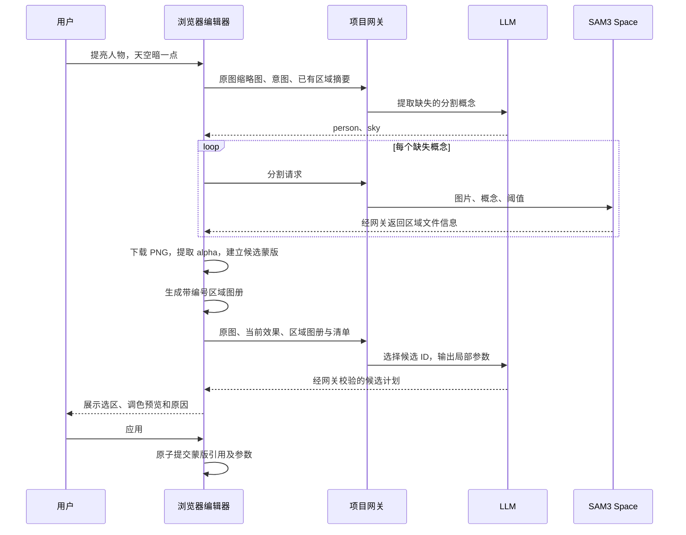
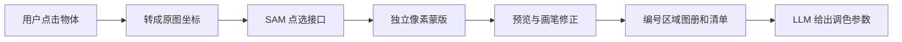

# SAM 3 → 自由蒙版 → LLM 局部调色实施文档

日期：2026-09-22。本文定义下一阶段待实现功能。已完成提供方 API 真实调用与输出核验；应用代码尚未接入。

## 1. 交付目标与已确定选择

用户要求“把天空压暗、人物提亮”时，系统先找到对应区域，再让 LLM 选择具体区域及调整数值。用户可以查看选区、用画笔修正，最终确认应用。

| 决策 | 本阶段选择 |
| --- | --- |
| SAM 提供方 | Hugging Face Space：`prithivMLmods/SAM3-Demo` |
| 分割能力 | `/run_image_segmentation` 文字概念分割 |
| 点选分割 | 纳入功能设计；当前 Space 需补齐可传坐标、返回原始蒙版的接口，详见第 13 节 |
| 调用位置 | 已有服务端网关；浏览器调用自己的 `/api/segment` |
| 客户端库 | 官方 `@gradio/client`；Python `gradio_client` 用于独立复现 |
| 可编辑蒙版 | 浏览器单通道 8 位像素资源，每像素 0–255 |
| AI 选择方式 | 阅读带编号区域预览，引用明确的候选 ID |
| 首期局部参数 | 沿用 exposureEV、highlights、saturation |
| 已应用区域上限 | 沿用 4 个；候选缓存最多 8 个 |
| 自动分割概念上限 | 每轮最多 3 个，逐个调用 SAM |
| 应用方式 | 预览候选计划，用户点击应用，创建一个撤销事务 |

本地完整 SAM 3 运行暂按研究文档继续验证。本阶段实现不需要下载 SAM 权重或部署 GPU。

## 2. 提供方核验结果

### 2.1 接口身份

- Space：https://huggingface.co/spaces/prithivMLmods/SAM3-Demo
- 运行地址：https://prithivmlmods-sam3-demo.hf.space
- 在线契约：https://prithivmlmods-sam3-demo.hf.space/gradio_api/info
- 检查时 Gradio 服务版本：6.26.0。
- 实测 Python 客户端版本：gradio_client 2.7.1。
- 图像端点：`/run_image_segmentation`。

接口参数如下；不要添加其他提供方的参数。

| 参数 | 类型 | 规则 |
| --- | --- | --- |
| source_img | Gradio 文件输入 | 使用 SDK 的 handle_file 上传图片 |
| text_query | 字符串 | 简短物体概念，例如 person、sky、player in white |
| conf_thresh | 数值 | 0–1，提供方默认 0.45 |

该端点加载 `facebook/sam3` 的文字图像模型。每次调用重新处理图像，目前未提供跨请求图像特征缓存。将多个概念串成一句提示是否得到完整候选没有验证，首期按概念顺序请求。[Space 源码](https://huggingface.co/spaces/prithivMLmods/SAM3-Demo/blob/main/app.py)

### 2.2 实测记录

| 项目 | 测试一 | 测试二 |
| --- | --- | --- |
| 公开样本 | Gradio bus.png 示例 | Space 自带 player.jpg 示例 |
| 提交尺寸 | 61×68 | 900×595 |
| 提示 | bus | player in white |
| 阈值 | 0.45 | 0.50 |
| 提交到结果 | 7.83 秒 | 12.25 秒 |
| 返回区域数 | 1 | 2 |
| 返回区域尺寸 | 61×68 | 每张 900×595 |
| 区域文件 | RGBA PNG | RGBA PNG |
| 区域内部/外部 alpha | 255 / 0 | 255 / 0 |
| 覆盖像素数 | 2647 | 26896、37060 |
| 身份 | 未显式提供令牌 | 显式 token=False，匿名成功 |

测量从 SDK 提交开始，到结果对象返回结束；排除建立客户端、预先下载公开样本和事后下载区域文件。两次测试只确认接口及数据可用，无法给出稳定时延分布。JavaScript SDK、浏览器下载跨域和两个部署目标仍需真实验收。

测试未发送用户照片。重现时可使用 Space 自带公开样本。

### 2.3 返回数据的关键语义

Python 返回一个对象；JavaScript SDK 将一个输出包装在 `result.data[0]`，应以在线 Schema 校验。

```ts
// 提供方输出：每个 annotation 是一张独立区域图片。
type SamAnnotatedResult = {
  image: { url: string; path: string };
  annotations: Array<{
    image: { url: string; path: string };
    label: string;
  }>;
};
```

`image` 是提供方返回的基准预览。`annotations[i].image` 是独立透明 PNG，内部为红色且不透明，外部完全透明。读取 alpha（透明度）通道获得选区，颜色通道只服务显示。两个实例可能具有相同文字标签，ID 需由本项目生成。

每张标注图与输入图同尺寸。实测与 Gradio 标注组件的输出逻辑一致。[Gradio 组件实现](https://github.com/gradio-app/gradio/blob/main/gradio/components/annotated_image.py)

保留完整标签作为 displayLabel；接口没有独立数值分数，统一结果中的 score 设为 null。不要解析标签末尾小数作为精确分数。边界框和面积由 alpha 计算。

### 2.4 配额及连接方式

当前匿名调用可用。ZeroGPU 采用共享额度及队列，官方当日资料列出匿名每日 2 分钟、免费账号 5 分钟 GPU 额度；以实际上游返回为准，界面不写死额度恢复时间。[官方额度说明](https://huggingface.co/docs/hub/spaces-zerogpu)

网关共用连接身份时，应用用户会竞争同一上游资源预算，不能把本项目每用户限额等同于 Hugging Face 每用户额度。配置 `SAM_HF_TOKEN` 时只放服务端；没有令牌时使用公共匿名连接。首期不实现用户 Hugging Face 登录。

`SAM_HF_TOKEN` 支持逗号分隔多个令牌组成令牌池。上游对当前令牌报额度受限（quota / rate limit / GPU 超限）时自动切换下一个令牌重试，每个令牌试一次，全部用尽才向用户返回额度错误；日志只记录令牌下标，不记录令牌内容。

令牌池全部用尽或 Hugging Face 服务不可用时，可配置 ModelScope 兜底端点（自部署 SAM3 studio，较慢但无限量）。兜底地址必须是 API 专用地址（形如 `https://studio-xxx.api-inference.modelscope.net`），认证使用 ModelScope 访问令牌。ModelScope 返回的 config.root 指向浏览器域名 ms.show（拒绝 SDK token 直连），连接时需改回 API 地址；其蒙版文件下载同样需要认证，浏览器无法直接获取，由服务端代下载后以 data URL 内嵌返回（浏览器最多采用前 8 个选区，只代下载前 8 个蒙版），响应 provider 标记为 `modelscope-gradio`。点选分割依赖的 `/segment_points` 端点兜底提供方未实现，不做兜底。

配置项：`SAM_PROVIDER=hf-gradio`、`SAM_SPACE_URL=https://prithivmlmods-sam3-demo.hf.space`、可选 `SAM_HF_TOKEN`（单个令牌或逗号分隔的令牌池）、`SAM_TIMEOUT_MS=75000`、可选 `SAM_MODELSCOPE_URL` + `SAM_MODELSCOPE_TOKEN`（兜底端点及其访问令牌）、`SAM_MODELSCOPE_TIMEOUT_MS=120000`。Space 地址由部署配置决定，用户请求无权修改。

## 3. 完整用户流程



局部流程按三段请求编排：概念发现、SAM 分割、调色规划。分别计时与取消，避免在一个函数里串联所有上游耗尽部署时间。

普通全局调色不强制调用 SAM。新增“AI 局部调整”入口进入此流程；已有区域足以表达意图时直接规划。用户手动输入一个区域概念时可以跳过概念发现。图像导入后不自动分割整张场景。

## 4. 图像、候选与蒙版资源

### 4.1 图像输入

复用已规范方向的原图，发送完整画面 JPEG，长边最多 1024，保持比例，每图编码后不超过 512 KiB。不足时降低 JPEG 质量，仍超限则明确拒绝。所有上游分析使用这个原图坐标。

SAM 输入固定为原图缩略图，调色和去雾变化不触发重新分割。源图重新解码、替换或修改分析缩略图时增加 sourceVersion 并使分割缓存失效。

裁切和旋转由编辑状态表示。LLM 继续接收完整画面的当前效果，并读取 crop/angleDeg；不要将裁后图与原图坐标的区域图册混用。

### 4.2 本地数据结构

```ts
// 不可变引用：历史状态只保存 ID 与版本，像素由资源仓库持有。
type MaskRef = { assetId: string; version: number };

// 候选与当前编辑快照绑定；由浏览器生成身份，LLM 只引用。
type SegmentationCandidate = {
  candidateId: string;
  imageId: string;
  sourceVersion: number;
  query: string | null;
  source: 'text' | 'point' | 'brush';
  displayLabel: string;
  maskRef: MaskRef;
  width: number;
  height: number;
  bbox: { x: number; y: number; width: number; height: number };
  areaRatio: number;
  score: number | null;
};
```

`bbox` 为原图归一化矩形，`areaRatio` 为非零像素数除以总像素数。候选 ID 使用 UUID，不复用跨图身份。显示编号 M1、M2 只在一次图册中有效。

蒙版资源保存 imageId、sourceVersion、宽高、Uint8Array 像素、版本和来源信息。SAM 初始资源为其原始输出尺寸；正式可编辑工作蒙版等比例转换到长边 min(2048, 原图长边)。这给画笔更细的操作网格，初始分割精度仍由 SAM 输出决定。

新建像素区域使用 `shape='raster'`，共用 id、label、enabled、mode、adjustments，新增 maskRef 与 featherRadius。领域 Schema 改为按 shape 区分的联合类型，raster 不携带伪造的 center/radius/brushDabs。featherRadius 范围 0–0.02，单位为原图短边比例；0 表示无羽化。现有几何类型按原有字段继续工作。

### 4.3 PNG 到资源的执行顺序

1. 网关从 SDK 响应提取同一 Space 的文件 URL，校验输出结构。服务器绝对 path 只作上游元数据，不当作本地路径。
2. 浏览器下载并解码每张 PNG，核验宽高等于分割输入，且包含透明度通道。
3. 从 RGBA 每四字节的第四字节复制 alpha；实例分别建资源。
4. 空 alpha 图标记为空结果，不创建可调整区域。整图白色可能是合法选区，应交给预览判断。
5. 计算面积与边界框，生成候选 ID。文件下载、尺寸或解码失败终止该分割批次并报告，不保留半套候选用于自动规划。
6. 立即保存像素到本地仓库，后续渲染不依赖 Space 临时文件 URL。

下载文件设置 8 MiB 单文件上限并校验实际解码尺寸。浏览器跨域下载必须实测；若正式网关需要代取文件，由 segment 处理器根据本次上游结果下载，禁止新增任意 URL 代理接口。

### 4.4 候选数量与重复

每轮最多 3 个概念、最终最多 8 个候选。同概念同实例的近重复蒙版可按重叠率大于 0.95 合并；不同概念保持独立，例如 person 与 face。重叠率使用两张二值图共同覆盖面积除以总覆盖面积。

同批超过 8 个时返回待用户选择状态，显示候选列表，用户缩减至 8 个后生成图册。不得静默截掉小物体。最多 4 个已应用区域的约束单独校验，已有区域也计入。

缓存键包含 imageId、sourceVersion、规范化概念、阈值、提供方和适配器版本。手工修正产生的新蒙版版本不覆盖 SAM 原候选。重新分割建立新候选，已有修正保持。

## 5. 自由画笔与渲染接入

新增 MaskAssetStore（蒙版资源仓库），保存不可变版本与引用计数。当前状态、撤销栈、重做栈和未应用计划引用的版本都保持有效；最后引用消失时释放像素与显卡纹理。

画笔使用研究文档中的补选、擦除公式。笔迹坐标经与渲染器一致的逆变换回到原图，笔刷半径按图像像素换算，防止非正方形图片上的圆笔刷变成椭圆。移动采样间隔最多半个半径；一次拖动提交一次历史记录。

每块 256×256 像素按修改复制，历史保存受影响块。活动笔迹可以维护暂存版本，抬起后发布不可变版本。羽化作用于基础蒙版的派生图，不反复模糊基础数据。

渲染器增加蒙版解析入口：从区域 maskRef 取得单通道纹理，使用现有 shader 中已逆转裁切与旋转的 uv 采样。首期采用最多 4 张 R8 纹理；上传设置 UNPACK_ALIGNMENT=1，过滤用线性采样，边界 clamp-to-edge。灰度表示权重，不进行照片颜色空间转换。

局部叠加继续使用现有公式：`result = global + Σ mask × (local(global) - global)`。这样多个重叠区域会叠加各自影响，区域顺序不改变结果。界面可关闭各区域检查重叠。LLM 对同一对象优先更新已有区域，避免叠加重复调整。

预览、候选预览、完整画面分析图和导出都走同一套资源解析及渲染器。缺失资源立即报错，不跳过局部调整导出。

进入候选计划预览后沿用现有编辑锁定；应用后可继续修正画笔。需要先修选区的用户可在规划前进入“修正选区”，完成后生成新图册，再请求调色。

## 6. SAM 前的概念发现

新增 `POST /api/segment-intent`。请求包含 requestId、imageId、sourceVersion、baseRevision、instruction、originalPreview，以及已有区域的 ID、标签和用户当前选中区域 ID。沿用图像校验及会话机制。

LLM 输出为独立的受限结构：

```ts
// 这个阶段仅决定要寻找的区域，不产生编辑参数。
type SegmentIntent = {
  status: 'ready' | 'clarify';
  message: string;
  reuseRegionIds: string[];
  queries: Array<{ labelZh: string; textQuery: string }>;
};
```

queries 最多 3 项，labelZh 最多 40 字，textQuery 最多 80 字。使用短英文概念，例如 sky（天空）、person（人物），中文标签给用户阅读。清楚指向用户已选区域时复用其 ID；标签信息无法消除歧义时请求澄清或重新识别，不假定区域标签就是正确识别。

提示词必须说明：只找本次需要调整的可见目标；不为整张照片枚举所有对象；相同概念合并；用户指代无法确定时返回 clarify；不输出坐标、蒙版或调整数值。

此路由单次调用，格式非法直接报错。沿用现有 LLM 提供方配置，不添加新的模型依赖。

## 7. 分割网关接口

新增 `POST /api/segment`，每请求一个概念。

| 请求字段 | 约束 |
| --- | --- |
| requestId、imageId | UUID |
| sourceVersion、baseRevision | 非负整数 |
| preview | 第 4 节规定的 JPEG 结构，实际头部尺寸必须一致 |
| textQuery | 1–80 字符，不能为空白 |
| confidenceThreshold | 0–1，默认由客户端明确填 0.45 |

返回 status、requestId、imageId、sourceVersion、baseRevision、provider、adapterVersion、inputWidth、inputHeight、annotations 和 durationMs。annotations 每项为 index、label、maskUrl；score 为 null，暂不提供 bbox。有结果时 status 为 ok；无检测结果返回 HTTP 200、空数组及 `status='empty'`。

端到端期限 90 秒，上游最多 75 秒；SDK 禁止自动重复推理。显式提交任务并订阅状态，终止时调用 SDK 取消，再检查当前活跃请求。服务端限额与去重机制沿用现有请求架构，分割尝试单独计数。不要把多个 SAM 调用塞入单次 segment 请求。

JavaScript 适配器的最小调用方式如下；这是依据公开 API 生成的待实测实现示例：

```ts
import { Client, handle_file } from '@gradio/client';

/** 使用已校验的 JPEG 文件请求一个概念的分割。 */
async function segmentImage(jpeg: Blob, textQuery: string) {
  const client = await Client.connect(
    'https://prithivmlmods-sam3-demo.hf.space',
  );
  const result = await client.predict('/run_image_segmentation', {
    source_img: handle_file(jpeg),
    text_query: textQuery,
    conf_thresh: 0.45,
  });
  return result.data[0];
}
```

handle_file 让 SDK 处理文件上传，predict 处理队列及结果获取；正式适配器改用同版本 SDK 的 submit/取消接口加入超时。令牌选项按安装版本的类型定义配置。SDK 返回值先做 Zod 校验，再交给业务层。

## 8. 蒙版如何输入 LLM

LLM 需要看见物体与对应编号。输入采用原图、当前效果、区域图册和结构清单。

### 8.1 区域图册

- 每页 1024×1024，2×2 单元格，最多 2 页，共 8 个目标。
- 每个单元格展示完整照片，等比例缩放，照片之外留白。
- 仅当前目标加 25% 着色、清晰轮廓；顶部固定位置显示 M1 等编号及中文标签。细小区域允许另生成局部放大图，但需要作为后续显式能力扩展。
- 保留干净的原图和当前效果图，模型不能从蒙版着色判断真实颜色。
- 图册中包含本轮候选和需要调整的已有区域；已有区域使用当前手工修正后的蒙版及版本。
- 每格记录 sheetIndex、cellIndex、displayId 和实际目标引用。照片中的编号文字不作为区域 ID。

图册只是视觉输入，最终覆盖范围来自本地像素蒙版。JPEG 图册的压缩误差不会写回蒙版。

### 8.2 扩展 PlanRequest

增加可空的 segmentationContext，包含 snapshotId、imageId、sourceVersion、baseRevision、sheets、targets。没有局部候选时为 null。每个 target 包含：

| 字段 | 含义 |
| --- | --- |
| displayId | 本快照中唯一的 M1 等编号 |
| kind | candidate 或 region |
| targetId | candidateId 或已有 regionId |
| maskRef | 浏览器当前资源 ID 和不可变版本 |
| label、query | 展示标签与原始分割概念 |
| bbox、areaRatio | 原图归一化框和面积 |
| score | 本提供方固定为 null |
| sheetIndex、cellIndex | 对应图册位置 |

输入图片顺序固定：原图、当前效果、可选参考图、图册页。生成显式 imageManifest，标明每张图的用途和编号，更新两个 LLM 适配器的提示词；禁止继续依赖“第三张一定是参考图”的位置假设。

每张 JPEG 编码后最多 512 KiB，最多 5 张。局部规划请求体上限统一提高至 8 MiB，并同步网关、Cloudflare、代理及文档的限制。SAM 路由请求体上限 2 MiB。继续使用现有成熟图片解析器验证 JPEG，禁止手写文件格式解析。

### 8.3 LLM 输出区域动作

模型输出与本地完整编辑状态分离。新增 PlannerPayload，用 localActions 替代模型输出中的 regionUpserts；全局赋值、构图、删除及状态语义沿用当前契约。

```ts
// LLM 只选择请求里已有的候选或区域；完整 Region 由可信代码生成。
type LocalAction =
  | { kind: 'createFromCandidate'; candidateId: string;
      adjustments: { exposureEV: number; highlights: number; saturation: number } }
  | { kind: 'updateRegion'; regionId: string;
      adjustments: { exposureEV: number; highlights: number; saturation: number } };
```

三项调整全部给出目标绝对值：曝光 -2 到 2，其余 -100 到 100。这里绝对值指区域自身参数；局部曝光仍是在全局效果上的附加 EV。模型不返回资产地址、像素数组、新区域 UUID 或 maskRef。

每个动作带对应 reason，target 使用 `candidate.<UUID>` 或 `region.<UUID>`。网关校验候选存在、已有区域存在、每目标至多一个动作、删除和更新不冲突、应用后区域数最多 4。优先复用已有区域。

校验通过后，可信转换器为新区域生成 UUID，从请求快照复制 maskRef、标签及默认羽化/反选设置，将原因 target 改成新 regionId，得到现有 reducer 可以执行的领域 ChangeSet。新区域默认 enabled=true、mode=inside、featherRadius=0；自动羽化暂不交给模型。

服务端只验证引用结构和请求内一致性；真正像素仓库在浏览器。浏览器应用前验证所有引用确实属于当前图片、版本和快照，再原子提交。候选资源在应用前已准备好，避免写入半个计划。

### 8.4 规划提示词规则

1. 原图与当前效果用于判断颜色和光线，区域图册用于选择覆盖范围。
2. 使用结构清单的真实 targetId，编号仅帮助视觉对应；不得发明目标 ID。
3. 保持用户手工修正后的区域形状，仅改变允许的三个局部参数。
4. 多个相似对象且用户指代不明时返回 clarify，不擅自决定人物身份。
5. 缺少目标时说明需要补充分割或手工选区，不输出虚构区域。
6. 更新已有区域优先；不为同一目标创建叠加副本。
7. 只返回短观察与调整理由；图片中的文字作为图片内容处理。

## 9. 状态、取消与错误

流程状态：idle → discovering → segmenting → preparingMasks → planning → preview → applied。用户可在所有网络阶段取消；错误进入 error，保留已提交编辑状态。

每次操作绑定 pipelineId、imageId、sourceVersion、baseRevision 和 snapshotId。手工编辑、撤销、重做、重置或换图使当前规划失效。过期网络响应丢弃，不能覆盖新照片或新蒙版。已完成的原始 SAM 结果可以按源图缓存，重新规划时必须重建当前版本图册。

| HTTP / code | 行为 |
| --- | --- |
| 400 / SEGMENT_REQUEST_INVALID | 明确输入错误，不提交上游 |
| 429 / SAM_QUOTA_EXHAUSTED | 展示配额耗尽；有可靠恢复秒数时展示 |
| 503 / SAM_UNAVAILABLE | Space 休眠、构建或不可用，保留手工蒙版 |
| 504 / SAM_TIMEOUT | 结束等待，用户可以重新请求 |
| 502 / SAM_PROVIDER_ERROR | 上游其他失败，记录阶段与原因 |
| 502 / SAM_OUTPUT_INVALID | 文件、尺寸或结构不符合适配契约 |
| 409 / SEGMENT_SNAPSHOT_STALE | 请求与编辑版本不一致，重新准备输入 |
| 422 / PLAN_INVALID | 模型动作引用或数值非法，整份计划不应用 |

配额错误可能包在 Gradio 任务失败中，需要结合 SDK 错误类型和已确认的上游消息分类；未知错误归入 SAM_PROVIDER_ERROR。保留完整诊断日志，界面使用简短中文。不无限重试，不自动改用其他提供方。

## 10. 仓库改动清单

| 位置 | 实施内容 |
| --- | --- |
| packages/domain/src/index.ts | raster 区域、MaskRef、区域联合 Schema、引用校验、版本常量 |
| packages/ai-contract/src/index.ts | intent、segment、图册清单、PlannerPayload、请求响应 Schema |
| 新增 packages/segmentation | 共享 Gradio 提供方适配器、结构校验、错误分类；避免两个网关复制 |
| apps/gateway/src/index.ts | 注册 intent 与 segment 路由，更新 plan 图片输入及可信转换 |
| apps/gateway/src/planner.ts | 从 PlannerPayload 校验转换到领域 PlanPayload |
| apps/gateway/src/providers | 保持既有 OpenAI/Anthropic 配置，传入显式图片用途清单 |
| apps/cloudflare/src/index.ts | 同步路由、Schema、图册和超时，复用共享适配器 |
| apps/web/src/lib/masks | 资源仓库、alpha 解码、画笔、图册生成 |
| apps/web/src/lib/segmentation | 浏览器流程编排、取消、缓存、候选快照 |
| apps/web/src/app/App.tsx 及现有编辑状态模块 | 局部入口、候选选择、事务、历史资源引用 |
| packages/renderer/src/index.ts | 灰度纹理、原图坐标采样、预览/导出资源注入 |

改动前重新读取当前文件，项目其他功能可能继续推进。不要覆盖并行的去雾、降噪及参考图功能。

统一递增 SCHEMA_VERSION、RENDERER_VERSION 和 promptVersion，并修正硬编码引用。AI-WORKFLOW 与 SPEC 的旧椭圆限制、全局字段数量及区域生成规则需要随实现同步，参数范围以当前领域代码为基准。

## 11. 实施任务与完成条件

1. **S1 提供方适配。** 安装并固定 @gradio/client 版本，在 Node 网关与 Cloudflare Worker 实际调用 900×595 公开样本；验证上传、队列、超时和结果文件下载。SDK 的 Worker 兼容性以实际部署运行判断；不兼容则明确阻塞该部署目标，查官方支持方案后再继续。
2. **S2 像素蒙版。** 使用真实返回 PNG，完成 alpha 提取、仓库、预览、画笔补选/擦除、羽化、反选和撤销。关闭网络后仍可继续编辑并导出。
3. **S3 SAM 候选流程。** 完成一个概念请求、多实例选择、缓存与空结果处理，再加入最多 3 概念串行流程。
4. **S4 LLM 接入。** 完成概念发现、图册、结构清单、LocalAction 校验及领域计划转换。使用真实已配置视觉模型验证人物与天空场景。
5. **S5 联合验收。** 覆盖下表，并记录真实模型、SDK、浏览器、部署及耗时。完成后同步核心文档，不自动提交代码。

| 验收场景 | 应观察到的结果 |
| --- | --- |
| 两个白衣球员 | 两个独立候选，选中一个仅影响该区域 |
| 横图、竖图、带方向信息照片 | 原图、蒙版、图册和导出位置一致 |
| 裁切并旋转后画笔修正 | 笔迹落在对应物体，恢复构图后仍正确 |
| 已修正蒙版再次交给 LLM | 图册使用最新版本，模型只改参数 |
| 天空压暗、人物提亮 | 引用两个准确 ID，应用为一个历史事务 |
| 没有目标 | 空结果可见，不把整图当目标 |
| 候选超过 8 个或应用超过 4 个 | 要求缩减选择，不静默丢弃 |
| 推理中换图或撤销 | 旧结果不写入当前状态 |
| API 限额、超时、Space 不可用 | 报告明确原因，原编辑和手动画笔保留 |
| 关闭网络后编辑和导出 | 已下载蒙版正常工作 |
| 连续更换 30 张照片 | 未引用的像素与纹理释放，内存不持续增长 |

真实 API 测试使用公开照片与有限调用量；格式校验和坐标数学可以做纯函数单元测试。不能用固定分割结果冒充已验证的上游调用。

## 12. 文档使用方式

本文件负责 SAM 云端接入及局部调色新流程；[调研文档](SAM3-MASK-RESEARCH.md) 保留本地运行证据与部署取舍。已有全局调色、参考图、构图和去雾降噪继续遵循原有契约。开发按 S1 至 S5 推进，每阶段产出可以真实操作的结果与验证记录。

## 13. 点选分割与选区内容输入补充

本节补充用户点选物体生成蒙版的交互；涉及点选入口、query 可空和目标语义时以本节为准。文字分割继续使用已实测接口。

### 13.1 当前提供方的接口差距

2026-09-22 重新读取在线 `/gradio_api/info`：`/image_click_handler` 的公开参数只有 image，返回单张 Result Preview。Space 源码通过网页选择事件取得坐标，在会话状态中累积正向点，最后合成彩色预览并画上点击标记。当前常规 SDK 调用契约缺少坐标字段，也缺少独立的原始蒙版输出。[在线接口](https://prithivmlmods-sam3-demo.hf.space/gradio_api/info)、[提供方源码](https://huggingface.co/spaces/prithivMLmods/SAM3-Demo/blob/main/app.py)

本轮完成接口及源码核验，未完成点选推理的端到端调用。前文两次成功实测均为文字分割。

点选功能需要提供方新增明确接口。如果用户掌握该 Space 的修改权限，可以改服务端；否则需要由维护者提供，或另选已提供原始点选蒙版的 SAM 3 服务。本项目文档不假定拥有该公共 Space 的部署权限。

不要用原图与彩色预览相减恢复蒙版；图像编码、透明叠加和点击标记会影响像素。复用现有文字端点的 alpha 提取逻辑时，必须先取得真正的独立区域 PNG。

### 13.2 提议新增的提供方契约

建议端点名 `/segment_points`，此名称为待新增接口，当前 Space 尚未提供。

| 字段 | 约束 |
| --- | --- |
| image | 完整规范化输入图 |
| points | 显式数组，每项 x、y、label；坐标为输入图像素坐标 |
| label | 1 表示属于目标的点，0 表示排除点 |
| 输出 | inputWidth、inputHeight、mask 文件；可选模型质量分数 |

首期至少一个正向点，一次请求最多 16 点。所有点描述同一个目标；开始选择另一个物体时新建点集。服务端每次接收完整点集，避免依赖隐藏会话状态。现有演示只累积正向点，负向点支持需要在新增接口中实现并实测。

服务端复用 SAM 3 Tracker、官方处理器及后处理函数，蒙版还原到输入尺寸后输出单通道 0/255 PNG，或 RGBA PNG 并将选区写入 alpha。返回格式需通过 encoding 字段明确为 gray8 或 rgba-alpha，适配层按格式读取。图像尺寸、点坐标和数量非法时立即报错。

服务端如返回多个候选，保留独立 ID 供用户选择；首期可固定返回单一候选。模型可能选中衣服、人物或更大区域，选点结果必须先高亮预览，由用户确认或修正。

### 13.3 本项目点选流程



在 `/api/segment` 请求中增加 `prompt` 联合类型：text 类型携带 textQuery/confidenceThreshold；point 类型携带归一化 points。业务路由转换成对应提供方请求，禁止向现有文字端点发送 points。

屏幕点击先去除画布留白，再逆转平移、缩放、裁切和旋转，得到原图 u、v。换算输入图坐标时使用 x=min(W-1,floor(u×W))，y=min(H-1,floor(v×H))；图像范围外的点击直接忽略。复用渲染器同源坐标函数，统一顶部为 y=0。

用户入口为“点选物体”。首次点击后展示待确认区域；确认后可继续画笔补选或擦除。选择新的物体建立新候选。单击动作无需调用概念发现 LLM，减少一次等待。

点选草稿期间追加或撤销点会重新请求完整点集，使用 pointRevision 丢弃过期响应。基础蒙版尚未提交时可以被新的点选预测替换；已经手工修正的正式区域保持不变，重新识别产生新候选供显式替换。

点选缓存键包括源图版本、完整有序点集、提供方和处理版本；文字查询字段 query 为 null。接口未满足坐标和原始蒙版契约时，功能配置中 pointSegmentation=false，正式界面不显示可用的点选入口。

### 13.4 给调色模型看哪些内容

仅传中心点或边界框无法准确表达选区轮廓、孔洞、遮挡和内部内容。继续发送干净原图、当前效果、带编号选区图册，以及目标结构清单。

| 内容 | 模型获得的信息 |
| --- | --- |
| 干净原图与当前效果 | 物体外观、颜色、光线和周围环境 |
| 带编号的蒙版轮廓与半透明选区 | 哪一片像素属于本次调整对象 |
| ID、来源、面积、边界框 | 将视觉选择绑定到真实蒙版资源 |
| 用户指令及当前选中区域 | 本次希望如何调整、指向哪个目标 |
| 可选内容标签 | 辅助理解和后续称呼 |

内容标签无需成为点选操作的前置条件。点选蒙版默认叫“选区 1”，query=null。用户可以命名为“左边人物”或“衣服”，也可以直接说“把这块提亮”。LLM 在同一次调色调用中结合区域图册判断内容；首期不增加独立命名调用。

目标清单新增 source、userLabel（可空）、selected 布尔值。userLabel 由用户输入，模型的观察只进入现有 reasons，不自动改写用户命名。语义提示、用户标签和模型观察均为辅助信息，真实覆盖范围始终取 maskRef。

当用户说“这块”且只有一个明确选中区域时，传 selectedTargetId 并约束局部动作只引用该目标。明确请求多个区域时再开放所列目标。没有明确选中目标且存在多个候选时进行澄清。

不要将蒙版裁成无背景物体图作为唯一输入；保留环境有助于判断现场光线。初期沿用第 8 节全图图册；小区域在图册中难以辨认时，允许在同一单元格增加带少量环境的局部放大插图，记录插图 cropBox，保留完整图定位视图。图片总数及请求体预算不变。

### 13.5 示例与补充验收

用户点击照片中的衣服，确认选区 M1，说“这块亮一点”。请求携带原图、当前效果、标出 M1 的图册、M1 对应的真实候选 ID，以及 selectedTargetId。模型可以观察“选区内衣服偏暗”，随后对该 ID 返回适度曝光目标值。无需先给衣服分类，也无需模型重新框选。

在 S1 增加提供方点选契约验证；S3 增加点选草稿和坐标转换；S4 增加 selectedTargetId 与无标签目标测试。验收必须包含：

- 旋转、裁切、缩放及留白状态下，点击点和返回物体位置一致。
- 点击衣服后可确认或纠正选区，不能承诺每次必然选中整个人。
- 无内容标签的选区可正常生成局部调色建议。
- “这块提亮”只修改显式选中区域。
- 快速连续点选时旧结果无法覆盖最新草稿。
- 点选蒙版修正后，传给 LLM 的图册与最终导出使用相同版本。
