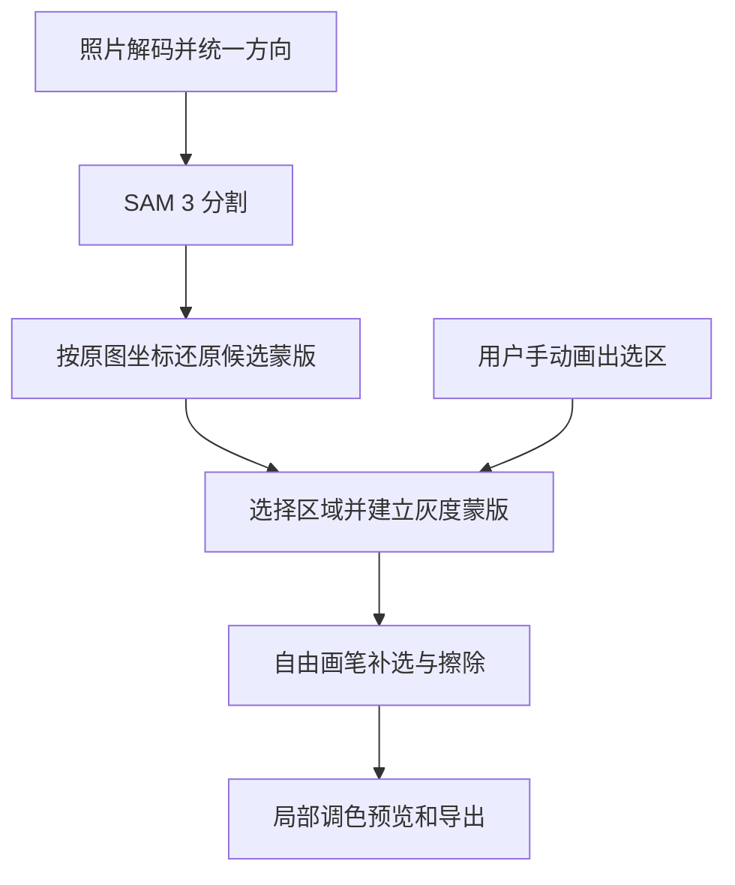

# SAM 3 分割与自由蒙版接入调研

日期：2026-09-22。状态：已通过 Gradio 客户端完成 SAM3-Demo 两次真实调用，并核验返回蒙版；浏览器 SDK、部署网关及跨设备测试待实施。完整接入契约见 [SAM 接入实施文档](SAM3-INTEGRATION-SPEC.md)。

## 1. 建议结论

采用 SAM 3 生成初始区域，用户用自由画笔补选、擦除，再应用局部调色。两种入口共用可编辑灰度蒙版。

部署选择：第一阶段采用 `prithivMLmods/SAM3-Demo` 的 Gradio 文字分割接口，蒙版编辑与调色始终在浏览器执行。完整文字分割的浏览器方案先做独立技术验证，通过目标设备验收后再决定是否成为正式选项。以下架构让部署位置可以独立替换。

产品目标是让 AI 提出“天空、人物、地面”等候选区域，并让用户或调色模型选择区域。SAM 3 的文字概念分割需要给定概念提示；应明确候选概念的来源，例如先由现有视觉模型提出少量概念，再交给 SAM 3。不要把无限类别、无提示的完整场景理解作为预处理假设。[SAM 3 官方说明](https://github.com/facebookresearch/sam3)

## 2. SAM 结果如何变成自由蒙版

灰度蒙版是一张记录调整强度的图片：黑色表示不调整，白色表示完全调整，灰色表示部分调整。SAM 输出提供初始选区；之后的画笔直接修改同一份数据。

### 2.1 当前代码与改造边界

检查时，`packages/domain/src/index.ts` 的区域支持椭圆、线性渐变和画笔，每个画笔区域最多 32 个笔触点，编辑状态最多 4 个区域。`packages/renderer/src/index.ts` 在着色器中逐点计算画笔覆盖。

接入建议：

| 模块 | 改动 | 原因 |
| --- | --- | --- |
| 领域状态 | 增加像素蒙版类型，区域引用蒙版 ID 和版本 | 保存复杂轮廓、孔洞和多个不相连部分 |
| 蒙版资源存储 | 保存灰度像素及历史版本 | 大块像素数据独立于普通参数状态 |
| 画笔工具 | 支持对蒙版增加、擦除、调节大小和软边 | 人工修正 SAM 遗漏或多选的边缘 |
| 渲染器 | 在原图坐标上采样灰度纹理，取得局部调整权重 | SAM 和手工选区共用调色流程 |
| 分割适配层 | 将云端或本地结果统一成候选蒙版 | 隔离模型部署方式和编辑器 |

保留现有椭圆、线性渐变工具。像素蒙版直接承载 SAM 结果，无需将轮廓拟合成笔触点。暂时保留最多 4 个已应用区域；候选区域可以更多，由用户或 AI 选入。

### 2.2 坐标契约

1. 基准图为解码后、已应用照片方向信息、尚未执行用户裁切和旋转的完整图片。记录 `imageId`、基准宽高与内容版本。
2. 分割输入可以缩小，但必须记录输入尺寸及其相对基准图的变换。初版使用完整图片缩略图，避免分割输入另行裁切。
3. 模型适配层负责把输出还原到完整输入图的坐标。检查提供方是否已经完成还原，避免重复变换。
4. 编辑器统一使用原图归一化坐标：左上角为 `(0,0)`，右下角为 `(1,1)`。蒙版自身有独立像素尺寸。
5. 用户缩放、旋转和裁切只改变观看范围。画笔落点通过逆变换回到原图坐标，蒙版始终跟随原物体。
6. 预览与导出使用相同蒙版版本、坐标变换和采样规则。还需统一纹理上下方向与像素中心约定。

Meta 的图像处理器包含直接缩放至 1008×1008 的路径，并将预测蒙版插值回原尺寸。不同转换模型可能采用不同预处理；逐个核对其实现，不能统一假设存在补边。[官方处理代码](https://github.com/facebookresearch/sam3/blob/main/sam3/model/sam3_image_processor.py)

### 2.3 输出数据与软边

适配层必须明确输出属于哪种数据：

- 二值蒙版：0/1 转为 0/255。
- 概率图：保留用于阈值处理的数据，并明确有效范围。
- 原始预测值：按模型约定转换成概率，且只转换一次。
- PNG 文件：检查实际尺寸与有效通道，从纯蒙版读取覆盖范围。

字段名不能代替数据契约；例如有的上游字段名称含 logits，但实现已经转换成概率。适配器应以实际计算过程为准。

初版建议将概率按固定、可追踪阈值转换成选区，再提供独立羽化参数。羽化指让边缘逐渐变淡。模型置信度与照片里物体的真实透明度含义不同，不能直接把概率当成发丝或玻璃的透明度。

每个物体候选单独保留 ID、概念、边界框、置信度和蒙版。提供编号叠加预览，让调色模型选择候选 ID；候选确认后建立稳定区域 ID。需要合并时取逐像素最大值，保留孔洞。

### 2.4 画笔与历史记录

以 `M` 表示原蒙版覆盖程度，以 `B` 表示本次画笔覆盖程度，两者范围均为 0 到 1：

- 补选：`M_new = M + (1 - M) × B`。
- 擦除：`M_new = M × (1 - B)`。

补选会逐渐增加覆盖，擦除会逐渐降低覆盖。笔迹需要沿移动路径插值，避免快速拖动留下断点。每次按下到抬起形成一次撤销操作。

保存未羽化的基础蒙版，羽化结果作为派生资源；调整羽化后仍能继续擦除。反选也作为渲染选项保存。

编辑状态只引用不可变的蒙版版本。历史记录不能引用持续修改的同一个 Canvas，否则撤销后仍可能显示最新笔迹。大图按块保存修改前后的数据，只记录画笔触及的块。

单通道 8 位蒙版每像素约 1 字节：2400 万像素约 24 MB，一亿像素约 100 MB，尚未包含历史、显卡副本及临时数据。初版验证可以使用长边 2048 的工作蒙版；必须同时检查 100% 放大与全尺寸导出边缘。若不足，再引入更高分辨率分块存储。放大低分辨率 SAM 结果不会补回缺失细节。

重新运行 SAM 生成新候选。用户确认采用后生成新版本，保留撤销能力。分割请求绑定源图 ID；切换图片后到达的结果不得写入另一张图片。

## 3. 浏览器运行的公开证据

### 3.1 两条能力路径

| 路径 | 适合的交互 | 已找到的证据 |
| --- | --- | --- |
| SAM 3 文字概念分割 | 输入天空、人物等概念，生成候选区域 | 社区完整图像/文字/解码模型转换 |
| SAM 3 Tracker 点选路径 | 用户点击物体，再补正负点修正 | 已有 Transformers.js 浏览器示例 |

Hugging Face 的 WebGPU 示例实际加载 `Sam3TrackerModel`，先计算并缓存图像特征，再根据点击解码蒙版。该示例证明点选流程可在浏览器运行，文字概念流程仍需独立验证。[示例源码](https://huggingface.co/spaces/webml-community/SAM3-Tracker-WebGPU/blob/main/index.html)

### 3.2 完整文字模型的体积和时延

社区 `rusen/sam3-browser-int8` 的模型卡列出约 889 MB 文件，其中图像编码器 466 MB、文字编码器 387 MB、解码器 35 MB。其报告的浏览器 WASM 耗时为 94.7 秒，WebGPU 6–18 秒明确标为估算，且该表未给出完整硬件条件。[模型卡](https://huggingface.co/rusen/sam3-browser-int8)

WASM 是浏览器中的本地计算运行方式，此处主要使用 CPU；WebGPU 让浏览器调用显卡。以上数据只能作为验证线索，无法直接承诺本产品耗时。

按 889 MB 和 100 Mbps 有效下载速度计算，首次下载理论上约 71 秒，还需加载和初始化。此项为算术估算。浏览器缓存可减少重复下载；加载缓存、建立会话和分析新照片仍有成本。

### 3.3 点选版本的实测参考

AnnotateIt 团队公开的 SAM 3 Tracker 浏览器测试：M4 Max、48 GB 统一内存、Chrome 151，图像编码中位数 3.29 秒，后续点击解码 42 毫秒，浏览器进程树内存增量 1295 MiB。该增量包含共享页面，不能当成显存峰值。测试针对其特定 Tracker 转换版本。[测试方法与结果](https://annotateit.ai/mobile-sam-vs-sam2-vs-sam3/)

这支持“先等待照片分析，再快速点选修正”的交互设计。完整文字分割在普通电脑上的体验需要另测。

### 3.4 效果是否衰退

浏览器这个运行位置本身不足以判断效果变化。重点检查：权重精度、模型转换、输入缩放、输出阈值和插值过程。

量化会使用更少的位数保存模型数值，减少下载和存储成本，也可能改变预测结果。8 位、4 位版本应分别评估，尤其关注细线、远处小物体、头发和低对比边缘。

上述完整模型卡提供单图预测分数对比，但预测分数代表模型自身的把握程度，无法替代人工标注下的精度测试。当前资料不足以量化“下降多少”。

### 3.5 性能需求与资源管理

暂时没有足够证据给出完整文字 SAM 3 的可靠最低显存要求。模型文件 889 MB 也无法推导运行时只需 889 MB。

运行内存还包括模型中间计算、图像特征、解码后的照片、WebGL 纹理及编辑历史。ONNX Runtime 的大模型文档说明浏览器缓冲区、WASM 地址空间及模型文件格式存在不同限制，需要分别检查。[运行时说明](https://onnxruntime.ai/docs/tutorials/web/large-models.html)

本地验证要求：

1. 在真实 Chrome、Edge 中检查 WebGPU 适配器与模型需要的运算支持，并运行真实模型。仅检查浏览器存在 WebGPU 接口不够。
2. 模型文件、转换版本和运行时版本固定，记录实际使用的计算后端。社区标注支持 WebGPU 仍需检查整张计算图的兼容性。
3. 推理放入 Worker，即浏览器后台线程，避免主界面被长任务阻塞。
4. 同张图片多次提示复用图像特征；更换图片释放旧资源。缓存键包含图像、模型和预处理版本。
5. 与去雾、降噪和大图导出协调运行，测试并发峰值；必要时排队执行这些重任务。
6. 本地不支持时明确报告原因，保留用户手动画笔操作。切换云端由明确的产品设置控制。

## 4. 已选云端提供方与统一接口

采用 [prithivMLmods/SAM3-Demo](https://huggingface.co/spaces/prithivMLmods/SAM3-Demo)。真实接口为 `/run_image_segmentation`，参数为 `source_img`、`text_query`、`conf_thresh`。默认阈值 0.45，返回基准图片和独立的 `annotations` 区域列表。[在线接口契约](https://prithivmlmods-sam3-demo.hf.space/gradio_api/info)

已实测：61×68 公交车照片返回 1 个区域，提交至结果约 7.83 秒；900×595 白衣球员照片返回 2 个区域，约 12.25 秒。第二次明确禁用客户端令牌，匿名调用成功。时间包含提交与排队等开销，排除客户端初始化及返回图片下载，不能解释为纯模型推理时间。

返回区域文件为 RGBA PNG，透明度通道保存 0/255 二值选区，尺寸与提交图一致。使用该通道转换灰度蒙版。该提供方无 `apply_mask` 参数，也未返回独立数值分数或边界框；标签中的两位小数只作展示，边界框由蒙版计算。

Space 使用 ZeroGPU 共享资源，受每日额度和排队影响。当前采用为开发与试用提供方；应记录额度耗尽和排队超时，不能承诺无限免费或固定时延。[ZeroGPU 说明](https://huggingface.co/docs/hub/spaces-zerogpu)

定义一个小型分割接口即可：

| 方向 | 必需内容 |
| --- | --- |
| 输入 | 请求 ID、图像 ID/版本、完整输入图尺寸、概念提示或点框提示 |
| 输出 | 提供方和模型版本、候选 ID、蒙版数据引用、尺寸、相对基准图的坐标关系、可选分数与框 |
| 诊断 | 下载/上传、初始化、图像编码、解码、后处理耗时；失败阶段和原因 |

编辑器接收统一后的灰度蒙版。后续更换云端服务或本地实现只涉及分割适配层。

## 5. 决策前的实际验证

### 5.1 样本与设备

选取至少 30 张真实照片，包括天空、人像、宠物、建筑、植被、暗光，以及头发、栏杆、孔洞、远处小物体。固定照片与概念提示，为代表区域制作人工参考蒙版。

设备至少覆盖当前产品面向的桌面 Chrome/Edge：一台 16 GB 内存的集成显卡电脑、一台独立显卡电脑；另加 Apple Silicon 设备作为平台比较。记录具体型号、显存或统一内存、浏览器和驱动版本。设备分组是测试范围，不能作为已验证最低配置发布。

### 5.2 测量项目

| 方面 | 记录方法 |
| --- | --- |
| 首次使用 | 清空模型缓存，从点击启用到第一张可用蒙版 |
| 已有缓存 | 重新打开页面，测加载、初始化、首次推理 |
| 连续使用 | 新照片首次分割、同图更换概念分别计时 |
| 稳定性 | 连续换图、取消、切换标签页后的结果与资源释放 |
| 资源 | 编辑器同时打开 2400 万像素照片时的内存峰值、可获取的 GPU 指标 |
| 质量 | 选区重叠率、边缘吻合程度、每类失败样本 |
| 产品体验 | 用户修到愿意应用调色所需的时间与笔画数 |
| 云端 | 固定服务与地区，多时段采样，拆分网络和服务耗时 |

隔离量化影响时，使用同一 SAM 3 权重来源、相同预处理和提示比较原精度与量化版本。云 API 若未披露模型精度，单独作为产品效果比较。

### 5.3 建议验收门槛

以下为产品目标，后续根据试用调整：

- 模型已加载时，新照片到首个可用区域，95% 的测试不超过 5 秒。
- 同图复用特征后的区域请求，95% 不超过 2 秒。
- 绘制与擦除期间画面保持流畅，推理期间已有调色和画笔仍可使用。
- 同一人工参考集上，量化版本平均区域重叠率相对原精度版本下降不超过 1 个百分点；困难样本逐张人工检查。
- 连续处理 30 张照片无崩溃，释放后内存不持续增长。
- 导出的选区位置、反选、羽化与预览一致；画笔修正可完整撤销和重做。

首次模型下载单独展示成本，不能混入缓存后时延。若下载负担无法被目标用户接受，即使推理达标，本地也只适合作为主动启用的选项。

## 6. 开发顺序

1. 完成灰度蒙版、画笔、撤销与导出一致性，用真实手工蒙版验证。
2. 接入已选 SAM3-Demo，按实施文档完成网关、蒙版转换和 LLM 区域选择。
3. 单独运行完整文字 SAM 3 浏览器原型，记录上述测试矩阵。点选 Tracker 可作为独立交互实验。
4. 根据数据决定部署：本地在目标设备达到质量、时延和稳定性门槛时再开放；云端方案按实测成本和时延验收。

目前建议采用“云端分割 + 本地蒙版编辑与调色”作为第一阶段方案。本地完整 SAM 3 保留为验证项，实际部署结论以测试记录更新。
